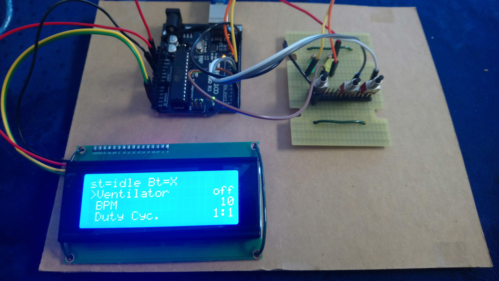
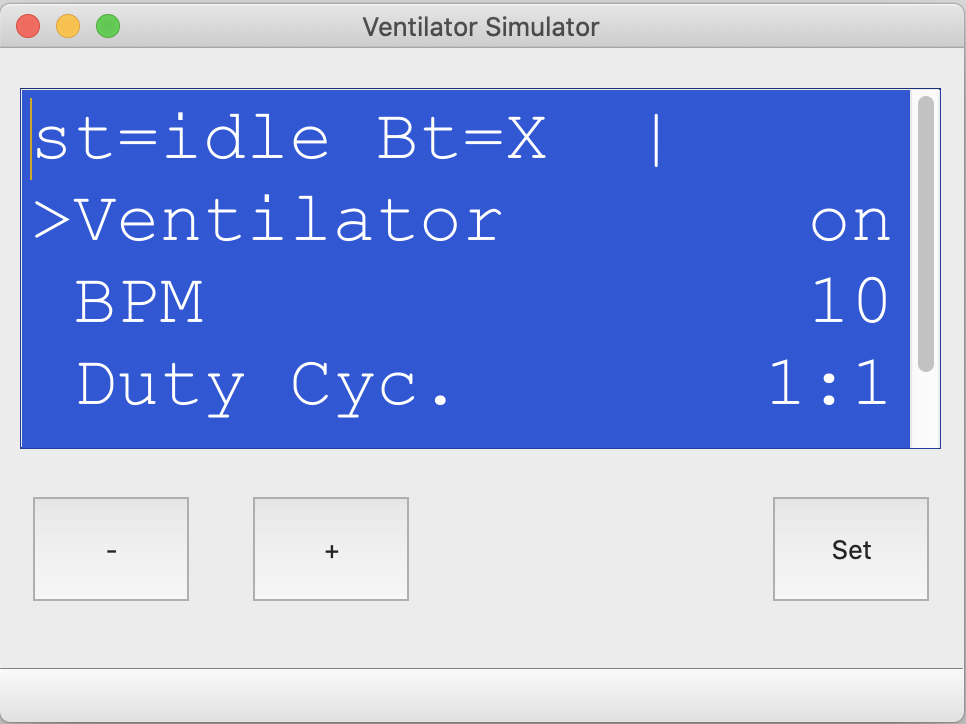

# Controller Source Code Projects

* **ArduinoVent** The final target code for the Ventilator Controller

* **VentSim** The VentSim purpose is to focus on UI and high level control of the Ventilator. Some particular files will be port to the real Ventilator project and others emulates the native Arduino libraries.

### Very first Prototype (before CSSALT PBC)

### CSSALT PCB Schematic (thanks to Ashhar):
[Click here to see the schematic](Docs/schematic.pdf)

### Demos and Tutorials Videos
[click here for playlist with demo videos and tutorials](https://www.youtube.com/watch?v=gKr-EH8vHxM&list=PLtBsFN3o4c54h5fr7lDnGuZhvKIA5Fhd3)

## Controller
Main function: Provides control for inhalation/exhalation valves and/or stepper motor; monitors pressure and tidal volume. alarms in case of unexpected parameters (unexpected pressure, A/C power down, reset and etc). UI operated by LCD (20x4 20X2 or 16x2) and 3 buttons. Main settings: BPM, duty-cycle, pressure and tidal volume threshoulds.

## UI Options
Whoever is producing the Ventilator can opt to use LCD's: 16X2, 20X2 or 20X4. Interface can be I2C or Parallel. 
## UI Initial concept/proposal

### LCD/Buttons Interface
VentSim simulates the LCD and buttons. The LCD displays the following rows:

Where the rows represent the following tokes:

 * **First Row**: St (Idle, On, or Error). 
   The last 6 characters on the right displays the breath progress, where "||||||" means lung full and 6 spaces empty lung. 

 * **The other rows** are scrollable and show parameters. In "Normal" mode the **"-"** and **"+"** buttons are use to scroll the parameter list. Pressing and hold the **"-"** button scrolls the list up to the top.
 To change a parameter the user needs to press and hold the **"Set"** button for half+ second; it enters in "Enter" mode; then the selected row starts flashing indicating that the parameter can be changed; the The **"-"** and **"+"** buttons increment or decrement the value; Pressing the **"Set"** button commits the change (and so if times-out) and return the unit to "Normal" mode. 

### To Do List
Click [here](TODO.md) to access the TODO list

