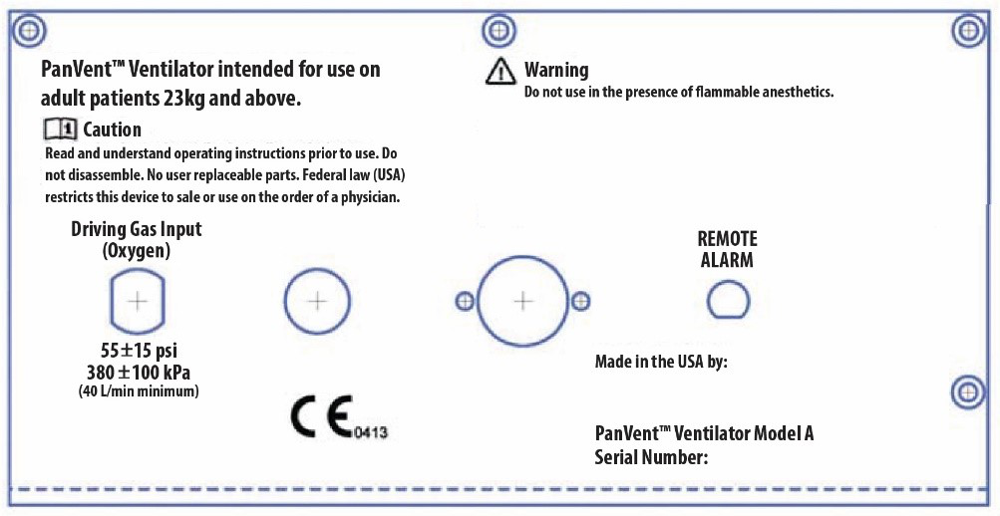

PanVent User Manual

| **Version** | **Date** | **Who** | **Comments** |
| --- | --- | --- | --- |
| **1.0** | **4/22** | **sl** | **First\_Draft – using pNeuton existing ventilator manual as template** |
| **1.1** | **4/23** | **sl** | **Continued edits** |
| **1.2** | **4/24** | **sl** | **Updated graphic for rear panel** |

PanVent TM is a Registered Trade mark of the University of Florida Research Foundation

# PanVent

**Pandemic Ventilator**

**Model**  **A**

# Operators Manual

97011

CD-A-005Rev I

_Released 24 April 2020_

Copyright©2020byUniversity of Florida Research Foundation

Manufactured by:

Airon®Corporation

751NorthDrive

Unit6

Melbourne,Florida32934 USA

Tel: 888-448-1238(tollfreeUSA&Canada

+1-321-821-9433

Fax:+1-321-821-9443

**Table of Contents**

[Section 1: General Description 1-1](#section-1:-general-description)

[Section2: Warnings, Cautions, Notes 2-1](#section-2:-warnings,-cautions,-notes)
  * [Warnings 2-1](#warnings)
  * [Cautions 2-3](#cautions)
  * [Notes 2-4](#notes)
  * [Indications for Use 2-6](#indications-for-use)
  * [Contraindications 2-6](#contrainditions)
  * [Medical Symbol Key 2-7](#medical-sybol-key)

[Section 3: Controls and Patient Safety Systems](#section3:-controls-and-patient-safety-systems)
  * [Front Panel 3-1](#front-panel)
  * [Rear Panel 3-3](#rear-panel)
  * [Unique Device Identifier 3-5](#unique-device-identifier)
  * [Internal Patient Safety Systems 3-6](#internal-patient-saftey-system)

[Section 4: Operating Instructions 4-1]($section-4:-operating-instructions)
  * [Ventilator Set-up 4-1](#ventilator-set-up)
  * [Operational Verification 4-2](#operationl-verification)
  * [Patient Ventilation 4-3](#patient-validation)
  * [Interrelationship of Volume and Rate Controls 4-4](#interrelationship-between-volume-and-rate-controls)
  * [Oxygen Control 4-5](#oxygen-control)
  * [Hypobaric Operation 4-5](#hypobaric-operation)
  * [Disconnect Alarm 4-5](#disconnect-alarm)

[Section 5: Patient Circuit 5-1](#section-5:-patient-circuit)
  * [Adult/Pediatric Circuit 5-1](#adult/pediatric-circuit)
  * [Ventilator Connection 5-2](#ventilator-connection)
  * [Single-Use only Devices/Accessories 5-3](#single-use-only-devices/accessories)

[Section 6: Accessories 6-1](#section-6:-accessories)

[Section 7: Theory of Operation 7-1](section-7:-theory-of-operation)
  * [Pneumatic System Diagram 7-1](#pneumatic-system-diagram)
  * [Pneumatic System Description 7-2](#pneumatic-system-description)
  * [Tidal Volume and Rate Control System 7-3](#tidal-volume-and-and-rate-control-system)
  * [Mandatory Breath Pressure Control System 7-5](#mandatory-breath-pressure-control-system)
  * [CPAP Demand Flow Breathing System 7-5]()
  * [Assist-Control System 7-5]()
  * [Oxygen Delivery System 7-6]()
  * [MRI Compatibility 7-9]()
  * [Disconnect Alarm 7-10]()
  * [Low Gas Supply Alarm 7-11]()

[Section 8: Troubleshooting 8-1]()

[Section9.CleaningandMaintenance 9-1]()
  * [Cleaning the Ventilator 9-1]()
  * [Cleaning/Disinfecting the Patient Circuit 9-1]()
  * [Routine Maintenance 9-1]()
  * Factory Preventive Maintenance 9-1]()

[Section 10: Specifications 10-1]()
  * [General Description 10-1]()
  * [Ventilator System Performance 10-1]()
  * [Alarm System 10-2]()
  * [Environmental and Physical Characteristics 10-3]()
  * [Power Sources 10-3]()

[Section 11: Limited Warranty 11-1]()
[Section 12: Index 12-1]()

## Section 1: General Description

PanVent TM (pronounced Pan Vent) is a small,light weight pandemic ventilator designed for
use on adult patients from pediatric to adult in size, 23 kg or greater. It is a time cycled,
 flow limited ventilator providing Intermittent Mandatory Ventilation(IMV). In this mode of
 ventilation, an adjustable respiratory rate and tidal volume are delivered to the patient.
 The patient is allowed to breathe spontaneously between the mandatory breaths with minimal
  work of breathing. A built-in PEEP/CPAPsystem can be set to provide expiratory positive
   pressure. The delivered oxygen gas composition is supplied by a gas source external to
 the ventilator and is adjustable to 65% or 100%, with oxygen as the driving source gas.
  The ventilator can accept and deliver oxygen compositions varying from 21% to 100%.

PanVent TM is an electronically controlled pneumatic ventilator. Electrical
power is not required for patient ventilation. PanVent TM has been specifically designed
for patient support during pandemic and non-critical care unit mechanical ventilation.
 It maybe used during intra and inter-hospital pandemic, in aircraft, on ambulances,
 in emergency rooms, MRI and other radiologysuites.in regular hospital settings as well
 as converted medical facilities such as convention centers and indoor stadiums.

## Section 2: Warnings, Cautions, Notes

The PanVent TM Ventilator is intended for use by properly trained personnel
under the direct supervision of licensed medical Physician or Practitioner only.
Personnel must be come thoroughly familiar with this Operators Manual prior to
using the PanVent TM Ventilator on a patient.

As used in this manual, the following terms mean:

**Warning:** Indicates the possibility for injury to the patient or the operator

**Caution:** Indicates the possibility of damage to the device

**Note:** Places emphasis on an operating characteristic

### Warnings

This manual serves as a reference. The instructions in this manual are not
intended to supersede the physician's instructions regarding the use of the
PanVent TM Ventilator.

The operator should read and understand this entire manual before using the
PanVent TM Ventilator.

**DO NOT** use the PanVent TM Ventilator in conjunction with
anesthetics or in contaminated(hazardous, explosive) atmospheres. Only compressed oxygen may be used.

**DO NOT** use conductive(anti-static)patient breathing circuits. The
*only* approved patient circuits for use with PanVent TM Ventilator are the circuits listed in Section5
of this manual. Any other patient circuit should **NOT** be used and may lead to patient harm.

The Operational Verification tests as described in this
manual(Section4) must
be performed prior to connecting a patient to the ventilator. If the ventilator
fails any of the tests it must be removed from pandemic clinical use.
**DO** **NOT** return the unit to pandemic clinical use until all repairs has
been completed by an Airon approved repair facility and all operational
verification tests are acceptable.

The PanVent TM Ventilator has been designed for use on adult and pediatric patients.
The PanVent TM cannot deliver operator adjusted tidal volumes less than 2360ml.
**DO NOT use the PanVent TM Ventilator on neonatal or infant patients, or small children.**

To protect the patient from high air way pressures, insure that the Peak Pressure
 control is adjusted appropriately.

### Cautions

**DO** **NOT** attempt to service the unit. Service may only be performed
by Airon Corporation authorized engineers. The Preventative Maintenance program
requires a general service and calibration every two years. Only original
manufacturer parts and accessories should be used.

Any attempts to modify the hardware of this device without the express written
approval of Airon Corporation University of Florida Research Foundation (UFRF)
will void all warranties and liabilities.

Do not immerse the PanVent TM Ventilator or allow any liquid to enter the controller
case or the inlet filter. Clean as directed in Section 9, Cleaning and Maintenance.

### Notes

In the USA the PanVent TM Ventilator is a restricted medical device intended for
use by qualified medical personnel under the direction of a physician.

**Additional Warnings, Cautions, and Notes are located throughout this manual.**

### Indications for Use

The PanVent TM Ventilator is intended for continuous mechanical ventilation
of patients in the following patient populations and use locations:

Patient population-adult COVID-19 / pediatric patients **23 Kg** or greater
who require the following general types of ventilatory support:
* positive pressure ventilation delivered invasively(via an ET tube) or
non-invasively(via a mask)
* CMV and assist-control IMV modes of ventilation
* with or without PEEP
* with oxygen or a mixture of air and oxygen

The ventilator is suitable for use in:
* Pre-hospital pandemic applications including accident scene, emergency rescue vehicles
* Hospital ICU pandemic applications including emergency, radiology, surgery,
post- anesthesia/recovery and MRI departments
* Air pandemic via helicopter or fixed wing

### Contraindications

The following conditions contraindicate the use of the

PanVent TM Ventilator:

* Patients under going procedures with flammable anesthetic gasses.
* Patients under going hyperbaric treatment.
* Infants and neonatal patients requiring tidal volumes less than 360ml.

#### PanVent TM Airon's Medical Symbol Key (Stopped reviewing and editing here – Sem 4/22/20)

|Symbol| Meaning|
|---|---|
||Consult Instructions of Use|
||CE Marked|
|  |Authorized Representative in European Community |
| | Model(Part)Number |
| | Lot Number |
| | Do Not Reuse |
| | MRI Conditional (3T) |
| | Manufactured Date |
| | Manufacturer |
| | Use By Date |
| | Keep Dry |
| | Caution, serious injury or device damage may occur by disregarding the instructions accompanying this warning symbol. |

## Section 3: Controls and Patient Safety Systems
### Front Panel

| Interface | Function |
| --- | --- |
| | Pressure gauge, patient circuit pressure|
| | PEEP/CPAP control: calibrated, range 0 to 20 cm H2O|
|| Tidal Volume control: calibrated, range 250 to 600 ml |
| | Respiratory Rate control: calibrated, range 103 to 30 bpm dependent on tidal|
| | Alarm visual indicator |
|  | AlarmReset/Silence,1 minute |
|  | Peak Pressure control of mandatory breaths: calibrated, range 15 to 40 cmH2O|
| | Mandatory Breath control, turns on or off mandatory breath system |
|  | Oxygen control, select either100% or 65% |
| | Patient Circuit connection, see Section 5 for a complete description of the patient circuit and it's attachment to the front panel|
| | Expiratory Valve connection |

### RearPanel

 Driving Gas Input(oxygen), DISS connection, requires 55+15psi(380+100kPa),(**40liter/minute minimum**)

| Interface | Function |
| --- | --- |
|**TODO: image here** | Alarm, Low Driving Gas|
| **TODO: image here** | Ambient Air Inlet Filter |
| **TODO: image here** | Remote Alarm out put |

### Unique Device Identification (UDI)

Pursuant to the U.S.FDA Unique Device Identification (UDI) Rule, each device must
bear a UDI code. The UDI for PanVent TM ventilator is located under the. "Serial Number:" labeling, in plaintext, on the back panel of the device. The UDI code consists of one Device
Identifier (DI) and potentially four Production Identifiers (PI).

Therefore, UDI=DI+PI. Production identifiers are required if the information appears on the product(box) label. The UDI on the product(box) label appears in both plaintext and
machine-readable format. The numbers in the parentheses indicate different parts
of the UDI, as applicable to the device:

(01) Device Identifier

(10) Batch/LotNumber

(11) Manufacturing/Production Date

(17)Expiration Date

(21)Serial Number

The format for Manufacturing/Production date and Expiration date within the UDI
code is: YYMMDD

* YY=tens and units of the year(e.g.2014=14)
* MM=number of the month(e.g. January=01)
* DD=number of the day(e.g. third day=03)
* e.g. January03,2014=140103

An example UDI for the PanVent TM ventilator is as follows:

Device Identifier=00853678006009

Serial Number=A0000

The Device Identifier portion of the code may be entered into Access GUDID to
obtain information about the product.[http://accessgudid.nlm.nih.gov/](http://accessgudid.nlm.nih.gov/)

### Internal Patient SafetySystems

The ventilator has several internal safety systems. These systems insure patient safety in the event of ventilator malfunction.

#### High Pressure Release

The patient circuit peak pressure is adjustable using the Peak Inspiratory Pressure
control. This control can be set from 15 to 60 cmH2O. The factory preset value is 40
cmH2O. In addition to this software control, there is an internal safety pressure release valve. This
valve will automatically limit circuit pressure to approximately 3 cmH2O, regardless of the setting of
the Peak Inspiratory Pressure control.

#### Anti-Suffocation System

An internal safety system will allow the patient to breathe on his or her own in the event of  
ventilator malfunction. At approximately 32 cmH2O negative pressure an internal valve will open
allowing unimpeded ambient air to enter the patient circuit for the patient. This system is always
available to the patient, irrespective of control settings, including PEEP/CPAP.
 **Software implementation too? Gordon?**

#### Low Gas Supply Pressure Alarm – Dave/Gordon: confirm we do not have this

When ever the driving gas supply pressure drops below the safe operating pressure the visual alarm
indicator will illuminate and an internal pneumatic audible alarm will sound. This low pressure alarm
will occur when the source gas pressure drops below 30psi(200kPa).The alarm will continue to sound
until all pressure has been lost in the system or when pressure is re-established
to at least 35psi (250kPa).

 **WARNING:** The Low Gas Supply Alarm will only activate for a very
short period of time if the gas supply abruptly ceases as can happen if the supply
gas becomes disconnected. Always insure that the supply gas is secure and
operating at the proper pressure.**??**

#### Disconnect Alarm

The ventilator automatically monitors patient pressure at all times. If there is a disconnection in the
patient circuit the visual alarm indicator will illuminate and the audible alarm will sound. The alarm
activates when either of the following conditions occur:

|Mandatory Breaths Status| Alarm Behavior|
|--|--|
|ON| if a circuit pressure of at least 15 cmH2O is not sensed within 22 seconds after the last breath – Gordon, confirm or modify|
|OFF | if the circuit pressure is less than 5 cmH2O for  22 seconds. Gordon, confirm or modify|

**The Disconnect alarm may be silenced for 1 minute by pressing the alarm Reset/Silence button.**

**NOTE:** Always use an external oxygen monitor to insure the desired oxygen percentage is delivered to
the patient.

## Section 4: Operating Instructions Ventilator Set-up

The following equipment is needed:

1. PanVent TM Ventilator with breathing circuit(see Section 5 for a list of compatible circuits.)
1. Test lung, (1 or 3 Liter bagrigidwall,AironPart#21002 suggested)
1. Spirometer
1. Watch

When ready:

1. Attach breathing circuit to ventilator as described in Section5.
1. Attach the test lung to the patient side of the breathing circuit.
1. Set the controls as follows:
  1. **Mandatory Breath** control to On
  1. **% Oxygen** to 21%
  1. **PEEP / CPAP** to Off
  1. **Peak** Pressure to 40 cmH2O
  1. **Tidal** volume to 400 ml
  1. **Respiratory Rate** to 12 bpm
1. Attach Oxygen Input on rear panel of the ventilator to a high pressure
oxygen source and turn on the oxygen.

**NOTE:** The ventilator will begin operation at the above settings when the oxygen is turned on. The
alarm will sound. You may press the "Reset/Silence" button to silence the alarm or wait for the unit to
begin ventilating.

### Operational Verification

| VerificationStep | AcceptableRange | Result |
| --- | --- | --- |
| Attach a spirometer to the expiratory valve using the elbow included in the circuit packaging outlet port. After 3 breaths measure the delivered tidal volume. | 4700±470ml | Pass/Fail |
| Count the respiratory rate with a stopwatch. Measure the number of breaths in one minute. | 12±2 breaths per minute | Pass/Fail |
|Remove the test lung and occlude the patient connection on the circuit. Read the circuit pressure from the pressure gauge electronic display on the front of the ventilator. | 450 ±5 cmH2O | Pass/Fail |
|Remove the occlusion and allow the breathing circuit to remain open. Using astop watch, measure the time until the alarm sounds | 22±3seconds | Pass/Fail |
| With breathing circuit remaining open, check that airway pressure reads 0 cm H2O | 0 ±1 cmH2O | Pass/Fail |
| With breathing circuit remaining open, check that flowmeter reads 0 L/min | 0 ±1 L/min | Pass/Fail |

If the ventilator has passed all the above steps it is ready
to return to clinical use. If the ventilator fails to pass any of the following tests do not apply it
to patients. Call your local distributor or Airon Corporation Customer Support at 888-448-
1238(toll free USA & Canada)or+1-321-821- 9433. Discard the unit. **Do not attempt to service the unit.**

 **CAUTION:** Do not disassemble the PanVent TM Ventilator. No
internal user replaceable parts. All service must be performed by Airon Corporation or an approved
service technician.

**Opening the device will negate the warranty. User will be responsible for all repair costs to service the unit.**

### Patient Ventilation

The ventilator operates with the following modes:

* CMV-Continuous Mechanical Ventilation
* Assist Control

Using the Continuous Mechanical Ventilation (CMV) mode, the ventilator provides an adjustable number of
breaths per minute. The tidal volume of these breaths is also adjustable. The patient may breathe
spontaneously between ventilator breaths as desired.

1.	Set the % Oxygen control to the desired FIO2 on the external blender or gas supply
1.	Set the PanVent On switch to On.
1.	Set the Tidal Volume control to the appropriate level by adjusting the pressure regulator – continue manual adjustment until the ensuing exhaled tidal volume displayed in ml on the user interface is within 10% of desired tidal volume
1.	Adjust the Respiratory Rate control to achieve the desired mandatory breath frequency.
1.	Adjust the Peak Inspiratory Pressure control to the desired level by turning the control while occluding the patient circuit and observing the level of pressure generated during a mandatory breath.
1.	Attach the patient circuit to the patient and observe for appropriate ventilation. Adjust as required. External measurement devices should be used to verify ventilation parameters.
1.	Adjust the PEEP control to the desired level.
1.	Adjust for spontaneous breath trigger sensitivity for assist control by the ventilator.
1.	Observe and monitor the patient and the ventilator per your institution's standards. If using a portable gas supply, monitor the supply level to insure there is sufficient gas for ventilation.

### Interrelationship of Volume and Rate Controls

There is an interrelationship between the Tidal Volume control and the Respiratory Rate control which
must be considered while operating this ventilator. The Tidal Volume control is a calibrated control
and will not vary from its setting during normal operation. It will not change if the Respiratory Rate
control is changed. The Respiratory Rate control is calibrated and will not vary
the patient's mandatory breath rate unless changed. However, if the Tidal Volume control setting is
changed the actual respiratory rate may change even if the Respiratory Rate control is not moved.

The ventilator operational characteristics define the reason the rate changes when the tidal volume is
changed. See Section 7 for a detailed description of the ventilator's Theory of Operation.

The Respiratory Rate control is calibrated for tidal volumes between 500 to 900ml. This allows the rate control to be preset with initial set-up of the ventilator on a patient.

Always count the patient's mandatory breath rate when first setting up the ventilator and after any
changes to the tidal volume to assure the patient is receiving the proper respiratory rate.

The mandatory breath inspiratory flow is fixed at 36L/min. Due to this preset flowrate, it is possible
that desired combinations of high tidal volume and respiratory rates may not be available. In
other words, combinations of high tidal volumes and high mandatory breath rates are limited by the
fixed mandatory breath flowrate. If a high respiratory rate is required, a lower tidal
volume may be necessary. Likewise, if a hightidal volume is required, a lower respiratory rate may be needed.

### Oxygen Control
The PanVent ventilator uses the gas mixture delivered to its gas inlet port. See Section 7 for a complete description of these systems. It is recommended that an external oxygen analyzer always be used to verify oxygen delivery.

### Hypobaric Operation

The ventilator will operate normally at altitudes up to 15,000 feet. Changes in altitude will not affect pressure settings. However, delivered tidal volume increases and respiratory rate decreases with increasing altitude. This is due to lower barometric pressure than ventilator calibration at standard sea level.

To compensate for the effect of changing altitude on tidal volume and respiratory rate, use an external spirometer to verify tidal volume accuracy. Adjust the Tidal Volume and Respiratory Rate controls to the desired value as measured by the spirometer rather than the markings on the control panel.

### Disconnect Alarm

The ventilator has a patient circuit disconnect alarm system. This system cannot be turned off. If a circuit disconnect is sensed, the visual indicator on the front panel will illuminate and the audible alarm will sound.

The alarm will activate as soon as an oxygen source is turned on to the ventilator. You may silence the alarm for 1 minute by pressing the Reset / Silence button. Attaching the ventilator to a patient and starting ventilation will automatically reset the alarm system and turn off the audible and visual indicators.

A patient circuit disconnect is sensed when any of the following conditions occur:
*	Mandatory Breaths “ON” – circuit pressure does not rise above 15 cm H2O within 22 seconds of the last time at least 15 cm H2O was sensed.
*	Mandatory Breaths “OFF” – a pressure of less than 5 cm H2O is sensed for 22 seconds

The alarm system can be momentarily silenced by pressing the Reset / Silence button on the front panel. Pressing this button turns off the visual and audible indicators for 1 minute. Each time the Reset / Silence button is pressed, the alarm system restarts the 1 minute silence time delay. This delay is NOT cumulative. In other words, repeatedly pressing the Reset / Silence button will not increase the silence time by more than 1 minute.

## Section 5: Patient Circuit Adult / Pediatric Circuit
### Adult Circuit

The patient circuit designed for use with the PanVent TM Model A is part number 58001, 6 ft. disposable patient circuit. The compression volume is 1ml per cm H2O.

Additionally, a full range of compatible patient circuits are available to meet your needs. Other patient circuits may become available in the future. All acceptable circuits will ~have part numbers from 58001 to 58999.~

| PartNumber | Description |
| --- | --- |
| ~~58001~~ | 6ft.(1.8m)disposable,boxof15 |
| ~~58006~~ | 6ft.(1.8m)disposable,withexpiratoryfilter,boxof15 |
| ~~58011~~ | 6ft.(1.8m)disposable,withlargeadultmaskandheadstrap,boxof10 |
| ~~58021~~ | 6ft.(1.8m)disposable,withexpiratoryfilter,largeadultmaskandheadstrap,boxof10 |
| ~~58051~~ | 8ft.(2.4m)disposable,boxof15 |

 **WARNING:** Patient circuits other than the circuits listed above
may alter the ventilator's PEEP characteristics and / or expiratory flow resistance. They should NOT be
used and may lead to patient harm.

 **WARNING:** Air filters on the expiratory port of the patient
 circuit may alter the ventilator's PEEP characteristics and / or expiratory flow resistance. If the
  filter increases the flow resistance of the exhalation limb past 5 cm H2O/L/min, it should NOT be
   used and may lead to patient harm.

 **CAUTION:** The PanVent TM ventilator requires the use of a cuffed
 endotracheal tube for proper device operation.

#### VentilatorConnection

The patient circuit must be attached to the ventilator properly. Incorrect attachment could result in
 failure to provide adequate ventilation.

 The main breathing hose (22 mm) is connected to the “Patient Connection” port

 The small tubing (3 mm) connects the expiratory valve to the “Expiratory Valve” port

**NOTE:** The patient circuit is a single use, disposable device. Cleaning, reprocessing and / or reuse of this device is not recommended. The circuit and all components are sold clean and non-sterile.

## Single-Use only Medical Devices/Accessories

### How do I know if a device is Single-Use?

This symbol will be identified on the packaging and User’s Manual of the device.

### What does Single-Use mean?

Do not reuse. A single-use device is used on an individual patient during a procedure, such as pandemic
 ventilation, and then discarded. It is not intended to be reprocessed and used again, even on the same
  patient.

### What is the concern with reused device labeled Single- Use?
The use of reprocessed devices may present serious incidents relating to the health and safety of patients and healthcare professionals. Reuse can be unsafe because of risk of:

*	Cross-infection – inability to clean and decontaminate due to design, device components are not manufactured for disassembly and reassembly, especially for the SARS-CoV-2 virus

*	Endotoxin reaction – excessive bacterial breakdown products, which cannot be adequately removed by cleaning

*	Patient injury – device failure from reprocessing or reuse because of fatigue or material alteration

*	Chemical burns or sensitization – residues from chemical decontamination agents on materials that can absorb chemicals

 **NOTE:** If you reuse a single-use device you may be legally liable for the safe performance of the device.

# Section 6: Accessories

Using the PanVent TM Ventilator should be convenient and user-friendly for healthcare providers and
 patients.
Accessories for the device add serviceability in clinical situations and allow the device to adapt to
 the environment of use.

| Accessory | Image | Description |
| --- | --- | -- |
|Adult patient circuit |  | Disposable, single patient use. |
| | | 6 foot (1.8m) and 8 foot (2.4m) length|
| Bacterial/Viral Filter |  | Disposable, sing patient uses.|
| | | Approved for use in in-line and on expiratory valve|
| MRI Compatible Mobile Stand |  | ~~3 foot, 9 inch (1.2m) tall~~|
||| ~~MRI compatible stand designed to hold the PanVent TM ventilator, model S or A. Two "E" size cylinders can be securely mounted on the stand. The ventilator attaches to the stand using a mounting plate, which allows the user to slide the ventilator on and off the stand for pandemic~~ |
|Test Lung |  | A 1L or 3 L bag is ideal to test the device performance |
|Bed Rail Mount |  | ~~Allows for PanVent TM ventilator to hang from standard critical care bed rails~~|
|| | ~~Mount fits securely onto the top of the ventilator and provides a sturdy support during patient pandemic.~~|
| Adult/Pediatric CPAP Masks |  | ~~Disposable, single patient use~~|
|||~~Adult Small~~|
|||~~Adult Medium~~|
||| ~~Adult Large~~|
|Remote Alarm |  | ~Respironics Model 1118941~|
|||~Allows the user to attach a remote alarm to the PanVent TM Ventilator. Great for the MRI control room.~|
| Remote Alarm Cables |  | ~MRI compatible BNC cables to attach the remote alarm to the PanVentTM Ventilator.~|
|||~50 foot (15 m) cable~|
|||~100 foot (30 m) cable~|
|Oxygen Regulator |  |  ~MRI compatible high pressure oxygen regulator for D / E size oxygen tanks~ |
|Oxygen Cylinder |  |E Size|
|||MRI compatible|
||| A 600 liter green oxygen cylinder with yoke stem valve|
|Reusable Patient Circuit |  | ~-	Adult/pediatric patient circuit, autoclavable~|
|||~1.8 meters (6 ft)~|
|||~**Available for International Customers Only.**~|

## Section 7: Theory of Operation

PanVent TM is a pneumatic ventilator based upon the Intermittent Mandatory Ventilation (IMV) principle. As such, adjustable respiratory rate and tidal volume breaths are delivered to the patient between which the patient may breathe spontaneously. This section describes how the ventilator operates.

Further information on the ventilator's theory of operation, including circuit diagrams, parts lists, and calibration instructions are available from CSSALT to properly trained service personnel.

### Pneumatic System

#### Pneumatic System Description

The major components of the pneumatic system and the control of gas flow through the ventilator are as follows:
1.	High pressure gas (oxygen) enters the ventilator and is filtered (5 micron) and reduced to a lower working pressure (35 psi - 240 kPa).
1.	The timing circuit uses two precision control valves to control inspiratory and expiratory time. These valves charge (or reduce) pressure to a pneumatic timing cartridge. This timing cartridge turns on or off the ventilator's main flow valve.
1.	The main flow valve controls gas flow from the internal regulator to the % Oxygen control, which in turn delivers it to the patient. The % Oxygen control setting determines whether flow goes directly     to the patient or through the high flow venturi. If gas is directed to the patient, a restrictive orifice limits the flow to a specific flow rate (36 L/min). If gas is directed to the high flow venturi, ambient  air is entrained to provide precisely the same flow to the patient, but at a reduced FIO2 (approximately 65%). The high flow venturi provides stable performance (no stall) up to the maximum operating pressure (75 cm H2O) of the ventilator.
1.	The pressure generated by the main flow valve also powers the Peak Pressure control system. This system sends an adjustable pressure to the patient circuit expiratory valve. The pressure in this system determines the peak pressure that can be generated in the patient circuit.
1.	The adjustable PEEP / CPAP system directs a pressure signal to the expiratory valve to generate PEEP and provides flow on demand for spontaneous breaths.

#### Tidal Volume and Rate Control System

PanVent TM’s Tidal Volume and Respiratory Rate controls function to determine mandatory breath inspiratory and expiratory time.

Since the ventilator provides a fixed flow (at 36 L/min or 600 ml/sec) during a mandatory breath, setting a specific inspiratory time also sets a specific tidal volume. This tidal volume is so precise that the inspiratory time control is calibrated to reflect the range of tidal volumes available (360 to 1,500 ml).

The ventilator's tidal volume output will not change in the face of increasing patient circuit pressure. The only change that may occur to actual patient delivered tidal volume will be caused by compression of gas based upon the compliance of the patient circuit used. The compression volume of the ventilator itself is negligible.

The Respiratory Rate control adjusts expiratory time with a range 0.6 to 20 seconds. Rate is controlled by increasing or decreasing expiratory time. With a set tidal volume a slower respiratory rate will equate to a longer expiratory time. Tidal volume is not affected by changes to the Respiratory Rate control.

The Respiratory Rate control is calibrated for set tidal volumes between 500 and 900 ml. The calibrated

Respiratory Rate range optimizes the interdependence between the expiratory and inspiratory time for
 ease of operation. If the tidal volume is changed and the rate is not changed, the number of breaths
 that can occur in one minute changes.

For example:

    Volume=600,RespiratoryRate=12
      (I time=1sec, E time = 4 sec, total time = 5 sec)
    Change the volume to 900
      (I time changes to 1.5 sec)
    Resultant Respiratory Rate is now 11
      (total time for inspiration and expiration = 5.5 sec)

    Volume = 600, Respiratory Rate = 12
      (I time = 1 sec, E time=4sec, total time = 5 sec)
    Change the volume to 1200
      (I time changes to 2 sec)
    Resultant Respiratory Rate is now 10
      (total time for inspiration and expiration = 6 sec)

Tidal volumes below 500 ml will result in faster rates than marked on the Respiratory Rate control.
Tidal volumes higher than 900 ml will result in slower rates than marked on the Respiratory Rate
control. The marks on the Rate Control are wide to reflect the range of control position that will
provide the desired rate over the range of tidal volume. Always count the respiratory rate when first
placing the ventilator on a patient and whenever changing tidal volumes.

As when using any mechanical ventilator, careful attention to detail is required. It is suggested that
independent validation of tidal volume and rate be performed using external spirometers and timing
devices.

### Mandatory Breath Pressure Control System

During normal mandatory breath inspiration the expiratory valve functions to prevent gas from escaping through the expiratory valve. The pressure used to close the expiratory valve is set with the Peak Pressure control. The range is 15 to 75 cm H2O.

The Peak Pressure adjustment can be used to manipulate the highest pressure applied during mandatory breaths.
*	If volume limited ventilation is the goal, set the Tidal Volume control to the desired volume and the Peak Pressure control to at least 10 cm H2O above the pressure required to deliver that tidal volume.
*	If pressure limited ventilation is the goal, set the Tidal Volume control to the desired inspiratory time and the Peak Pressure control to the desired peak pressure.
During pressure limited ventilation any excess flow will be released by the expiratory valve while maintaining the desired peak pressure. This flow release may cause a "honking" sound as gas escapes through the partially closed valve.

The Peak Pressure control can be tested by occluding the patient port of the patient circuit during a mandatory breath. During the breath the pressure will rapidly rise to the set peak pressure. Turn the Peak Pressure control until the desired peak pressure is achieved.

### CPAP Demand Flow Breathing System

The ventilator's internal CPAP demand flow system provides gas for spontaneous breathing at adjustable
CPAP pressures up to 20 cm H2O. This system has several key features:

1.	When turned on, the system supplies a continuous flow of gas at approximately 10 L/min during the expiratory time of the ventilator. This flow of gas helps to establish the desired CPAP level by balancing flow with the pressure generated on the expiratory valve by the CPAP system.
1.	The continuous flow of gas also establishes the flow sensitivity to spontaneous breathing efforts. If the patient's inspiratory flow demand exceeds the continuous flow of gas, additional flow will be added to meet patient demand. There is no sensitivity adjustment to this system. The CPAP system will automatically meet the needs of the patient, greater than 100 L/min, by attempting to maintain the balance between flow and pressure at the expiratory valve.
1.	The PEEP control was evaluated to the dynamics of XXXX disposable patient circuit. Using this circuit will insure proper operation and the full 0 to 20 cm H2O PEEP range.

### Oxygen Delivery System

With the ventilator driven by 100% oxygen as the source gas, the ventilator can be set to deliver 65% or 100% oxygen. There are two independent systems within the ventilator that determine oxygen concentration. The following section describes how these systems operate.

#### Mandatory Breaths

The % Oxygen control determines the oxygen concentration of the mandatory breaths that enter the patient circuit at the Patient Connection. When set for 65%, an internal high flow venturi system entrains ambient air to decrease the FIO2 while maintaining the correct tidal volume. The high flow venturi provides stable performance up to the maximum operating pressure (75 cm H2O) of the ventilator.

#### Spontaneous Breaths

Spontaneous breaths are available from the internal CPAP system which uses a venturi mechanism separate from the mandatory breath high flow venturi. When turned on by the PEEP / CPAP control, the system delivers approximately 10 L/min baseline flow during the expiratory time of the ventilator.

The FIO2 of this system is set by the % Oxygen control. When set for 65%, the actual oxygen percentage
and baseline flow is related to the level of CPAP in use. Up to 10 cm H2O CPAP will provide a FIO2 of
approximately 0.65 +/- 0.10. As the CPAP level raises to 20 cm H2O, the FIO2 can be expected to
increase to as high as 0.75 +/- 0.10.This is due to a drop off in efficiency (stalling) of the CPAP
venturi system at higher CPAP levels. The actual FIO2 of spontaneous breaths will be approximately the
same as the baseline flow. Whether set for 65% or 100%, extremely high inspiratory flow demand may
decrease the desired FIO2.

*It is recommended that an external oxygen monitor be used at all times to measure and display the delivered oxygen concentration.*

 **WARNING:** Never operate the ventilator without proper oxygen gas supply at the required pressure.

#### Factors Effecting the Operating Time of Oxygen Tanks
There are several factors that affect the length of time the ventilator will operate from a tank of oxygen. The ventilator uses very little gas for its own operation (less than 4 L/min) and is not a major factor in oxygen tank consumption. The major factors are:

* Volume of oxygen in the tank
* Patient's tidal volume and rate
* Position of the % Oxygen control
* If the PEEP/CPAP system is on or off

Setting the % Oxygen control to 65% will decrease the amount of oxygen used from the tank, nearly doubling the time an oxygen tank lasts.

**NOTE:** Always use full oxygen and air tanks before the start of any pandemic. The calculation of any
expected run time becomes unreliable as tank pressure is reduced.

#### Example of expected operating time using a full "E" size cylinder (660 liters) PEEP/CPAP off

|Minute Volume|100% Oxygen|65%Oxygen|
| -- | -- | -- |
|5 l/m | 77 min | 80 min |
|10l/m | 40min | 76min |
|15 l/m | 33min | 60min |

The PEEP / CPAP system, when turned on, uses approximately 5 L/min oxygen from the tank to provide the 10 L/min baseline flow of the system. The patient's own spontaneous tidal volume and rate will use additional oxygen from the tank, based upon the tidal volume of those breaths.

#### Example of expected operating time using a full "E" size cylinder (660 liters) PEEP/CPAP on

| Minute Volume | 100% Oxygen | 65% Oxygen |
| --- | --- | --- |
| 5l/m | 29min | 37min |
| 10l/m | 26min | 33min |
| 15l/m | 23min | 30min |

used. In addition, safe MRI practice calls for all devices used in the proximity of a MRI scanner be anchored to prevent inadvertent movement.

### MRI Compatibility

The ventilator was engineered and built to be MRI compatible. Testing in a MRI scanner has shown
that the scanner does not affect the ventilator's performance. The ventilator does not generate artifact, RF noise, or other deleterious effects on the operation of the MRI scanner or it's production
of an image. In addition, due to PanVent TM Ventilator components, heating of the ventilator does not
occur during scanning.

Testing for MRI compatibility was done following ASTM MRI safetystandards F2052–06e1 and F2119–07. The
MRI scanner used has the following maximum performance levels:

* Static field strength-3Tesla
* Spatial field gradient-720G/cm

The scanner used for testing was an active shielded system. The ventilator was placed in the position
of maximum field strength and maximum spatial gradient. The standard patient
circuit(Aironpartnumber58031) was used. A standard imaging sequence with a maximum scanning time of 5
minutes was used.

**TODO: Retrieve image**:w
The PanVent TM Ventilator meets testing requirements for use within the Magnetic Resonance Environment
with a conditional marking for safety.

**NOTE:** Airon recommends that users perform the above referenced tests in their MRI scanner prior to
patient use.

 **WARNING:** While tests show that the ventilator functions at the
bore of the MRI unit, Airon Corporation does not recommend that the ventilator be clinically used at or
with in the bore of MRI scanners. A minimum proximity of 12 inches(0.3meter) from the bore should be
used. In addition, safe MRI practice calls for all devices used in the proximity of a MRI scanner be
anchored to prevent in advertent movement.

### Disconnect Alarm

The ventilator has an internal patient circuit disconnect alarm system. This system cannot be turned off. If a circuit disconnect is sensed, the visual indicator on the front panel will illuminate and the audible alarm will sound.

The alarm will activate as soon as an oxygen source is turned on to the ventilator. Attaching the ventilator to a patient and starting ventilation will automatically reset the alarm system and turn off the audible and visual indicators

The alarm system can be momentarily silenced by pressing the Reset / Silence button on the front panel. Pressing this button turns off the visual and audible indicators for 1 minute. Each time the Reset / Silence button is pressed, the alarm system restarts the 1 minute silence time delay. This delay is NOT cumulative. In other words, repeatably pressing the Reset / Silence button will not increase the silence time by more than 1 minute.

The alarm system is entirely pneumatic and uses no electricity. A series of valves and pneumatic capacitances provide the sensing network. Two subsystems are used, one for when Mandatory Breaths are turned on and another for when Mandatory Breaths are turned off. This allows  the alarm to operate when only CPAP is functioning. Due  to the nature of this system, a minimum CPAP of 5 cm  H2O is required. If CPAP is set for less than 5 cm H2O and Mandatory Breaths are not turned on, the alarm system will activate.

The alarm system provides a passive, non-electrically charged remote alarm output on the rear of the ventilator.

### Low Gas Supply Alarm

The Low Gas Supply Alarm will occur if the driving gas supply drops below safe levels (30 psi, 200 kPa). The alarm activates as long as driving gas is available or until the supply pressure returns to normal.

When operating from an oxygen cylinder the ventilator will gradually use up the gas in the cylinder and tank pressure will fall. Once the cylinder pressure reaches approximately 500 psi, most portable tank regulators will start to decrease pressure to the ventilator during mandatory breaths. As this happens that Low Gas Supply Alarm will sense the decreased pressure and begin to intermittently alarm each time the pressure drops during inspiration. As pressure in the cylinder falls to lower values, the amount of time the regulator is delivering low pressure increases and the alarm sounds longer. Eventually the regulator is unable to maintain pressure and the alarm will sound continuously until all gas in the cylinder is used.

 **WARNING:** The Low Gas Supply Alarm will only activate for a very
short period of time if the gas supply abruptly ceases. This can occur if operating from a wall source
and the gas supply hose is disconnected from the gas supply outlet. In fact, the Low Gas Supply Alarm
may not sound at all when the ventilator is disconnected from a wall source. This is because all gas in
the high pressure hose immediately exits out from where the hose was connected to the outlet and there
is no gas pressure to power the ventilator’s alarm. When using the ventilator on a patient always
insure that the supply gas is secure and operating at the proper pressure.

## Section 8: Troubleshooting

This troubleshooting guide lists common problems that may be encountered and possible solutions. If none of the corrective actions seem to work, contact CSSALT or your distributor.

| **Indication** | **Meaning** | **Corrective**** Action** |
| --- | --- | --- |
|Ventilator does not operate – no patient ventilation| Missing or insufficient driving gas supply | Check gas source, 55 psi (380 kPa) at 40 L/min is required |
||Patient circuit disconnection | Reconnect patient circuit |
||Internal malfunction| Send ventilator for service|
|Ventilator seems to “want” to operate, but no breaths are generated| Peak Pressure control set too low |Increase Peak Pressure control|
||Respiratory Rate set too low	|Increase Respiratory Rate
|| Expiratory valve drive line disconnected | Insure tubing is properly connected | Expiratory Valve is malfunctioning	Replace patient circuit|
||Insufficient driving gas supply	| Check gas source, 55 psi (380 kPa) at 40 L/min is required|
||Internal malfunction	| Send ventilator for service|
|Ventilator appears to be stuck in inspiration	|CPAP may be turned on high	| Check CPAP control|
||Internal malfunction | Send ventilator for service
|Ventilator stops and starts | Insufficient driving gas supply | Check gas source, 55 psi (380 kPa) at 40 L/min is required|
|Lower minute volume than desired |	Insufficient driving gas supply |	Check gas source, 55 psi (380 kPa) at 40 L/min is required|
||Leak in the Patient Circuit or Expiratory Valve	| Replace patient circuit|
||Obstruction of gas output	| Check or replace patient circuit|
||Use in hyperbaric condition |	Ventilator should not be used in hyperbaric conditions|
|| Tidal volume control out of calibration | Send ventilator for service|
||Internal malfunction | Send ventilator for service|
|Higher minute volume then desired | Use at higher altitude then calibration | Use external spirometer to verify tidal volume|
||Tidal volume control out of calibration |	Send ventilator for service |
||Internal malfunction | Send ventilator for service|
|Higher minute volume then desired|	Use at higher altitude then calibration|	Use external spirometer| to verify tidal volume|
||Tidal volume control out of calibration |	Send ventilator for service|
||Internal malfunction	|Send ventilator for service|
|Tidal volume inaccurate	|Leak in the patient ET-Tube, mask, breathing circuit or expiratory valve|	Check patient interface.| Replace patient circuit if at fault|
||	Ventilator is operating at an altitude different then calibration	|Tidal volume should be measured by an external spirometer|
||	Tidal volume control out of cal |	Send ventilator for service|
| Rate control inaccurate | Tidal volume set below 500 ml or above 900 ml | This is normal. Rate will be faster when tidal volume is set lower than 500 ml. Rate will be slower when tidal volume is set higher than 900 ml|
||Rate control out of cal |	Send ventilator for service|
|Patient pressure too high|	Tidal Volume set too high|	Decrease Tidal Volume or Peak Pressure setting|
||Patient response	|ET-Tube may be occluded or patient may be biting tube|
||Expiratory Valve malfunctioning|	Replace patient circuit|
||Internal malfunction| Send ventilator for service|
|Can’t get the PEEP / CPAP desired |Expiratory Valve malfunctioning|	Replace patient circuit|
||	Using a circuit not recommended by CSSALT|	Replace patient circuit|
||	Internal malfunction|	Send ventilator for service|
||	Excessive “chattering” of CPAP system|	Occurs when using some test lungs but will not when connected to a patient. If problem persists, send ventilator for service|
|Ventilator using too much gas	PEEP / CPAP| system turned “on”	| Turn off PEEP / CPAP system|
||	Leak at source gas |	Check hoses and tank regulator for leaks|
||	Internal leaks|	Send ventilator for service|
|Oxygen concentration too low|	Source gas not 100% oxygen|	Insure source gas is 100% oxygen|
||	High patient spontaneous ventilation |	Decrease spontaneous ventilation|
||	Internal malfunction	|Send ventilator for service|
|Alarm activated|	Patient circuit disconnection|	Reattach circuit or locate leak|
||	Alarms at start-up when gas is supplied to ventilator|	Normal operation. To silence alarm, attach patient (or test lung) or press Reset| Silence button
||	Expiratory valve tubing disconnected | Insure tubing is connected properly|
|| Leak in the Patient Circuit or Expiratory Valve|	Replace patient circuit|
||Insufficient driving gas supply – alarm sounds briefly during each mandatory breath|	Tank may be low. Check gas source, 55 psi (380 kPa) at 40 L/min is required|
|| Mandatory Breaths OFF and CPAP set to less than 5 cm H2O	| Set CPAP to at least 5 cm H2O or Mandatory Breaths ON |
|Excessive patient effort	If peak pressure does not reach 15 cm H2O due to patient insp effort during mandatory breaths, alarm will sound. This is normal operation|
||Internal malfunction	|Send ventilator for service|
|Alarm does NOT activate|	Patient circuit occluded	Check circuit|
||	Expiratory valve drive line kinked or occluded |	Check / replace patient circuit|
||Internal malfunction	|Send ventilator for service|
|Visual alarm activates but audible does not| Reed Cap Malfunction|	Replace reed cap on back of unit|

## Section9: Cleaning and Maintenance

### Cleaning the Ventilator

*	Use only mild detergent or disinfectant and water with a soft cloth.
*	Do not immerse the ventilator in water.
*	Do not attempt to sterilize the ventilator with autoclave or ethylene oxide. Severe damage to the ventilator may occur.

#### Cleaning / Disinfecting the Patient Circuit
The patient circuit is a disposable, single use device. This circuit must not be cleaned, disinfected or reused.

See Single-Use only Medical Device information.

#### RoutineMaintenance

CSSALT recommends that an Operational Verification Test (see Section 4) be performed at initial installation and prior to use on each patient. Institution’s standards may require additional biomedical surveillance. No additional routine maintenance is required.

 **Factory Preventative Maintenance**

 *	Ventilator service is required every 2 years to ensure continuous safety and reliability of the ventilator.
 *	Ventilator service includes:
    * Replacement of internal filters
    * Replacement of internal materials subject to wear
    * Reconditioning of the enclosure
    * Complete calibration
 *	This service must only be performed by approved service technicians.
 *	Failure to perform this service may result in malfunctioning of the ventilator.

## Section 10: Specifications

### General Description
*	Pneumatically operated ventilator provides automatic mechanical ventilation with a built-in PEEP / CPAP demand flow system for spontaneous breathing
*	Patient ranges: pediatric to adult, > 23 kg.
*	Equipment not suitable for use in the presence of flammable anesthetics
*	Rated for continuous operation

### VentilatorSystemPerformance

|	Controls | limitations |
|--|--|
|Mandatory Breaths	 | On or Off
| Respiratory Rate	  |from 3 to 50 bpm
|	Tidal Volume	      |from 360 to 1,500 ml
| Peak Pressure	      |from 15 to 75 cm H2O
|	PEEP / CPAP		      |from 0 to 20 cm H2O
|	% Oxygen		        |100% or 65%

|Operating Ranges | |
|--|--|
| Inspiratory Time | 0.6 to 2.5 seconds |
| Expiratory Time | 0.6 to 20.0 seconds |
| Minute Volume | 0.2 to 30 L/min |
| Flow Pattern  | square,36L/min |
| Internal P Limit | 80cmH2O |

|Accuracy of Controls| |
|--|--|
|Respiratory Rate | +/- 10%(VTbetween500-900)|
|Tidal Volume | +/-10% |
|Peak Pressure | +/-10%|
| PEEP/CPAP | +/-5%|
| FIO2, mandatory breaths | +/- 10%|

| Precision-breath to breath repeatability of controls | |
|--|--|
| Respiratory Rate | +/-10%|
| Tidal Volume | +/-25ml |
| Peak Pressure | +/-5cm H2O |
| PEEP/CPAP | +/-2cmH2O |
| FIO2 | +/-5%|

|Specificity-effect of one control on another ||
|--|--|
|Respiratory Rate - if tidal volume is constant | +/-5%|
|Tidal Volume | +/-5% |
|Peak Pressure | +/-5% |
|PEEP/CPAP | +/-5%|
| FIO2 | +/-5%|

|Internal Compliance | 0.1ml/cmH2O|
|--|--|

| Ventilator Resistance to Flow | |
|--|--|
| Inspiratory, 60L/min | lessthen2cmH2O/l/sec |
| Expiratory,50L/min | lessthen2cmH2O/l/sec |

### Alarm System

* Patient Disconnect
  * Pressure:
    * mandatory breath OFF, less than 5 cmH2O
    * mandatory breath ON, less than 15 cmH2O
  * Alarm delay: 22 seconds
  * Alarm silence: 60 seconds

* Low Gas Supply
  * Input supply pressure: less than 30psi (2.1bar)
  * Cannot be silenced

### Environmental and Physical Characteristics

* MRI Conditional. Tested with a scanner up to:
  *	Maximum static field strength - 3 T
  *	Maximum spatial field gradient - 720 G/cm

* Hypobaric (high altitude) compatible up to 15,000 feet
* Weight and Size: 6.5 pounds (3 kg), 5.0"H x 10.0"W x 7.3"D (12.7 cm x 25.4 cm x 18.5 cm)
* Storage Temperature Range: -20 to 60 °C (-4 to 140°F), 15 to 95 percent humidity, noncondensing

### PowerSources

*	Driving gas requirement
  *	55 psi + 15 psi (380 kPa + 100 kPa)
  *	100% oxygen. Do not use the ventilator with other types of gases.
  *	The gas supply must be capable of delivering at least 40 liters per minute at 55 psi. If input pressure drops less than 30 psi due to insufficient gas flow, the ventilator will alarm and begin to malfunction.

**NOTE:** Driving gas consumption at 10 L/min minute volume;
*	PEEP / CPAP off: 4 L/min
*	PEEP / CPAP on, 65%: 9 L/min
*	PEEP / CPAP on, 100%: 15 L/min

## Section 11: Limited Warranty

CSSALT, through its Official Distributor, warrants this product to be free from defects in construction, material and workmanship for a period of twelve (12) months from the date of original delivery to buyer when operated properly under conditions of normal use for which the product is intended. This twelve (12) month warranty does not extend to expendable items such as membranes, hoses, patient circuits and filters which are warranted to be free of defects only at time of original delivery.

The official CSSALT Distributor will, at its option, either repair or replace any defective product, as above defined, which is reported to that CSSALT Distributor within 72 hours of occurrence during the warranty period. If so instructed by the Distributor, such defective products must be returned to the official CSSALT Distributor in the original container with freight charges prepaid. In any case, the CSSALT Distributor shall be responsible for repairs to, or replacement of, such defective product only.

### LIMITATIONS ON AND DISCLAIMER OF WARRANTIES:
CSSALT and its CSSALT Distributors shall be relieved of any liability under this warranty: if the product is not used in accordance with manufacturer's instructions; if attachment or incorporation of any device is made to this product without written approval; if use is made in any manner other than intended by the manufacturer; if regular periodic maintenance and service is not performed; if repairs are made by other than authorized service personnel; if the product has been subject to abuse, misuse, negligence or accident. Any product that has been mechanically or electronically altered without specific written authorization from CSSALT is also excluded from this warranty.

The warranty described in this Agreement is in lieu of all other warranties. THE PARTIES AGREE THAT THE IMPLIED WARRANTIES OF MERCHANTABILITY AND FITNESS FOR A PARTICULAR PURPOSE AND ALL OTHER WARRANTIES, EXPRESS OR IMPLIED, ARE EXCLUDED FROM THIS AGREEMENT.

Except as stated above, CSSALT or its Distributors  SHALL NOT BE LIABLE FOR ANY DAMAGES, CLAIMS OR LIABILITIES INCLUDING, BUT NOT LIMITED TO, PERSONAL BODILY INJURY, OR INCIDENTAL, CONSEQUENTIAL, and OR SPECIAL DAMAGES.

## Section12:Index

### A
* Accessories 6-1
* Administering Oxygen 7-6
* Airway Connection Port 3-3
#### Alarms:
  * High Pressure 3-5
  * Low Gas Supply 3-6, 7-11, 10-2
  * Patient Disconnect 3-7, 4-5, 7-10, 10-2
* Altitude Operation 2-4, 4-5
* Anti-Suffocation System 3-6
### C
* Cautions 2-3
#### Circuit, Patient Breathing:
  * Cleaning 9-1
  * Configuration 5-1
  * Connecting 5-2
#### Cleaning:
  * Patient Breathing Circuit 9-1 Ventilator 9-1
* Contraindications 2-6
#### Controls:
  * % Oxygen 3-2
  * Peak Pressure 3-1
  * PEEP / CPAP 3-2
  * Respiratory Rate 3-2
  * Tidal Volume 3-2
* Continuous Flow - CPAP 7-5
#### CPAP:
  * Control 3-1
  * Functional Operation 7-5
  * Trigger Sensitivity 7-6
### E
#### Expiratory Valve:
  * Connection 3-3, 5-2
  * Relationship to PEEP/CPAP System 7-6
### F
* Front Panel 3-1
### H
* High Altitude Operation 4-5
* HighPressureAlarm3-7
* HyperbaricOperation2-2
* HypobaricOperation4-5
### I
* Indications For Use 2-6
* Internal Patient Safety Systems 3-6
* Interrelationship Between Volume & Rate Controls 4-4,7-3
### L
* Low Gas Supply Alarm 3-6,7-11
### M
* Maintenance-Ventilator Service 9-1
#### Mandatory Breaths:
  * FIO2 4-5
  * Flow Rate 6-3
  * Interrelationship Between Volume & Rate Controls 6-3
* Medical Symbol Key 2-7
* Mode of Operation 2-5, 6-1
* MRI Compatibility 7-9, 10-2
### N
* Notes 2-4
### O
* Operational Verification 4-2
#### Oxygen:
  * % Oxygen Control 3-2
  * Driving Gas Inlet 3-4
  * Driving Supply Requirements 10-3
  * Operational Characteristics 7-6
  * Tank, Expected Operating Time 7-7
### P
* Patient Circuit Cleaning 9-1
  * Configuration 5-1
  * Connecting 5-2
  * Disconnect Alarm 3-7, 4-5
  * Single Use 5-3
* Patient Ventilation 4-3
* Peak Pressure Control 3-1
* Performance Verification 4-2
#### PEEP/CPAP:
  * Control 3-2
  * Functional Operation 7-5
  * Trigger Sensitivity 7-6
* Pneumatic System 7-2
* Pneumatic Low Gas Supply Alarm 3-6
#### Power Requirements:
  * DrivingGasSupply10-3
#### Pressure:
  * Peak Pressure Control 3-1
  * PEEP/CPAP Control 3-2
* Pressure Gauge 3-1
* Preventative Maintenance 9-1
#### Principles of Operation:
  * CPAP Demand Flow Breathing System 7-6
  * Mandatory Breath Pressure Control System 7-5
  * Oxygen Delivery System 7-6
  * Pneumatic System Diagram 7-1
  * Pneumatic System Description 7-2
  * Tidal Volume and Rate Control System 7-3
### R
* Rear Panel 3-3
#### Respiratory Rate:
  * Control 3-2
  * Interrelationship Between Volume & RateControls 4-4,7-3
### S
* Safety Systems 3-6
* Sensitivity 7-6
* Set Up 4-1
* Service, Preventative Maintenance 9-1
Single-Use only Devices/Accessories 5-3
#### Specifications:
  * AlarmSystem10-2
  * Environmental and Physical Characteristics 10-3
  * General Description 10-1
  * Power Sources 10-3
  * Ventilator System Performance 10-1
#### Spontaneous Breaths
  * FIO2 7-7
### T
#### Tidal Volume:
  * Control3-2
  * Interrelationship Between Volume & Rate Controls 7-3
#### Theory of Operation:
  * CPAP Demand Flow Breathing System 7-5
  * Mandatory Breath Pressure Control System 7-5
  * Oxygen Delivery System 7-6
  * Pneumatic System Diagram 7-1
  * Pneumatic System Description 7-2
  * Tidal Volume and Rate Control System 7-3
  * Trouble shooting Ventilator 8-1
### U
* Unique Device Identifier (UDI) 3-5
### V
* Ventilator Set-up 4-1
* Verification, Operational 4-2
### W
* Warnings 2-1
