# Assembly Instructions
DRAFT V1.
Gordon L. Gibby MD KX4Z
Address questions to docvacuumtubes@gmail.com

|DATE| VERSION| Changes|
|---|---|---|
|4/15/20| Draft 1.0| Original Document|
|4/20/20| Draft 1.1 |Utilized Ashhar 1.0 Board|
|||Added wooden standoffs glued to Ashhar 1.0 Board|
|||Allows use of 4x20 display, but compatible with 2x16 code;|
|||with a different cut-out will accmodoate 2x16 display as well.|
|||Mounted Transducer board to front panel instead of to rear of main board|
|||Provided a Drill Template and dimensions.|
|||Provided a working list of TOOLS REQUIRED|
|4/20/20| Draft 1.2 |Added missing photo of the tools required.|
|4/21/20| Draft 1.3| Added wiring information for I2C bus connections to Transducer board|
|4/23/20| Draft 1.4| Details on final build of Prototype #2|
|4/24/20| Draft 1.5| Added overview wiring diagram|
|||Added R-numbers to Schematic, added missing R10 to list.|
|||Rewrote bill of materials for the electrical construction of the transducer board.|
|||Rescanned the schematic to improve quality.|
|||Listed “missing” resistors (not used)|

## Partial Mechanical Bill of Materials

|# |Item Description| Item sourcing suggested|
|--|--|--|
|1| Carlon 8”x8”x4” electrical box|Home Depot or equivalent https://www.homedepot.com/p/Carlon-8-in-x-4-in-PVC-Junction-Box-E989N-CAR/|
|2| Chosen LCD Display| Connection pins must be on the back of the board and must be long enough to properly connect to the socket on the main board.|
|||20x4: https://www.amazon.com/gp/product/B00GZ6GK7A/ref=ppx_yo_dt_b_asin_title_o08_s00?ie=UTF8&psc=|
|||https://www.amazon.com/gp/product/B071W8SW9R/|ref=ppx_yo_dt_b_asin_title_o06_s00?ie=UTF8&psc=
|3 |Pushbuttons| https://www.amazon.com/gp/product/B0752RMB7Q/ref=ppx_yo_dt_b_asin_title_o09_s00?ie=UTF8&psc=|
|4| Pine dowels |3/8” outer diameter x 0.90” length, square cuts, pine (soft)Remember to make pilot drills before inserting sheet metal screws.|
|5| Sheet metal screws| #6 x 5/8” to secure the main board standoffs from the front –qty 3 required.|
|6| #16 or #18 stranded wire, both red and black colors required.|Power supply wiring|
|7| #22-#28 stranded wire| To wire the push buttons. Stranded wire from a Cat5 ethernet cable is excellent.|
|8| Solenoid output jack| CB microphone 4-pin secure insulated jack https://www.amazon.com/PIN-PANEL-MOUNT-MICROPHONE-CONNECTOR/dp/B00H579TXU|
|||Pin 1 = MOTOR_A|
|||Pin 2 = MOTOR_B|
|||Pin 3, 4 = GROUND|
|9| Solenoid plug| https://www.amazon.com/4-PIN-CB-MICROPHONE-PLUG/dp/B00H572J3W (CB microphone 4-pin plug)|
|10| Mean Well 15 volt medical grade power supply| https://www.digikey.com/product-detail/en/mean-well-usa-inc/GSM40B15-P1J/1866-2009-ND/|
|11| BMP or BME| Adafruit version:|
|||https://www.amazon.com/Adafruit-BME280-Temperature-Humidity-Pressure/dp/B013W1AJUY (I2C address 0x77 if not jumpers utilized)
|||An alternative Kee-Yee product has been successfully used but requires a different I2C address (0x76)|
|12| Airway tubing connectors| https://www.amazon.com/Swordfish-61120-Vacuum-Connector-Assortment/dp/B07HV8CVZ|
|13| I2C 3.3V differential pressure transducer, 200Pa| https://www.digikey.com/product-detail/en/amphenol-all-sensors-corporation/DLHR-F50D-E1BD-C-NAV8/442-1163-ND/
|14| PCB for I2C 3.3 V differential pressure transducer, 200 Pa|Manufacturer may redesign the Transducer/power supply board, or use standard perfboard for mounting.|
|15| Nylon insulated standoffs with M3 threads, screws and nuts, assorted lengths|Assortment: https://www.amazon.com/gp/product/B01HDR72Q2/ref=ppx_yo_dt_b_search_asin_title?ie=UTF8&psc=
||Barbed plastic airway tubing connectors |https://www.amazon.com/Swordfish-61120-Vacuum-Connector-Assortment/dp/B07HV8CVZ
||Optional Battery| DURA 12-3.3F Duracell 3.3 AGM 12V sealed lead battery.|
||20x4 Standoffs| M3 nylon standoffs 0392” from shoulder to flat side (Mthreaded screw portion is in addition to this size)|
||Transducer board Standoffs| M3 nylon standoffs 0.600” from shoulder to flat side, not including the threaded screw portion.|

### DRILL TEMPLATE (must be printed so that the lines are exactly 1” grid)
This photo would not fit on this page so it is shown at approximately 66% of normal size

#### NOTE FOR AIR PRESSURE CONNECTORS:

|---|---|
|If using small fuel tubing (approx 1/8” ID) the smallest size nipple (1/8”) in the specified vacuum fitting set will work.| Drill 0.160 for the 1/8” barbs from the specified kit|
|If using smaller tubing (e.g. for 2mm brass connectors)| Drill appropriately for the 2mm connectors.|
||If you have these – it is an advantage as the connections to the I2C differential pressure transducer work better with the 2mm tubing.
||If you don’t have them --- then use tubing to make “adapters” of short sections to go from small tubing to large tubing.|
||The final released versio to the hospitals should have 2mm connectors for the flow measurements, but we can fix that later.|

## Actual Assembly Instructions
### Micro Controller and Electrical Cabinet
1. **Use good engineering practice in all steps where there are issues and record any pertinent
discoveries or suggestions for improvement back to the CSSALT Team (Travis Johnson) @ UF.
Please note any errors in dimensions or conflicts and notify additionally
docvacuumtubes@gmail.com**
1. Choose either a common 16x2 or 20x4 LCD display of any desired color, as requested by
customer, without I2C connectors (we are using parallel wiring connections). The 20x4 is preferred.
The photos that follow are for a 20x4 build. See bill of materials above.
1. Choose an Arduino Nano with 328P processor or suitable backwards compatible improved
device with equal or greater RAM / EEPROM. (Program with supplied code from UF CSSALT)
1. Acquire the electrical plastic cabinet. 8”x8”x4” or larger. A suitable box is: Carlon
[https://www.homedepot.com/p/Carlon-8-in-x-4-in-PVC-Junction-Box-E989N-CAR/100404099](https://www.homedepot.com/p/Carlon-8-in-x-4-in-PVC-Junction-Box-E989N-CAR/100404099) (as per
Bill of Materials above)
1. If the customer requests built-in battery backup, procure a DURA 12-3.3F Duracell 3.3 AGM
12V sealed lead battery.

    This battery can be glued with Epoxy glue as follows, and **must be fully charged by an external
    power supply (suggested, Walmart Everstart 3A battery smart maintainer) before delivery** :

    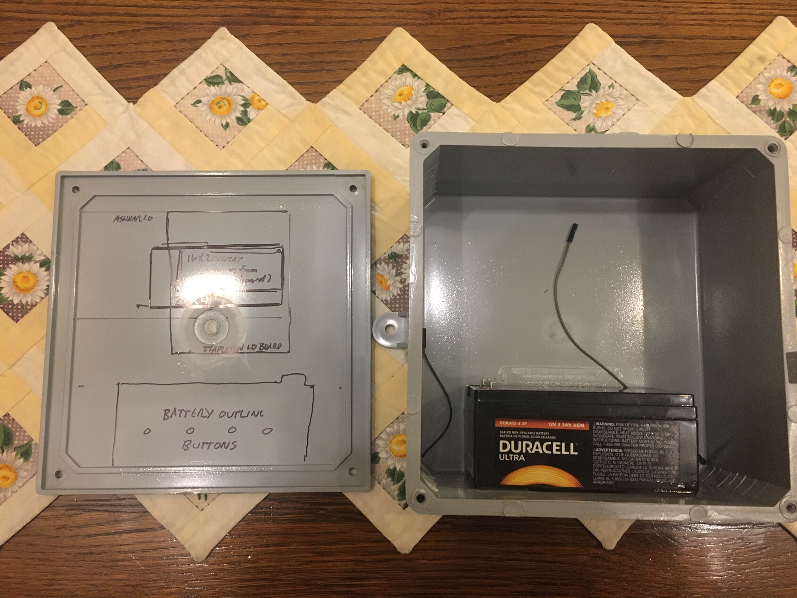

1. Assemble the Ashhar Farhan v. 1.0 Board. With the following adjustments:

    |#| Item| Comment|
    |1| BNC or RCA phono jacks NOT REQUIRED |You will likely prefer to utilize #18 or # stranded wire to connect to the “CB 4-pin microphone jack” INSTEAD OF THE BNC OR RCA PHONO JACKS|
    |||Pin 1 = output of MOTOR_A|
    |||Pin 2 = output of MOTOR_B|
    |||Pin3 , 4: GROUND|
    |||Jack body of 4-pin microphone jack – unconnected.|
    |||You may also utilize the appropriate BNC or RCA phono plug if you prefer to install the jacks, and wire to the CB 4-pin microphone jack. This is up to manufacturer preference.|
    |2 |298 Motor controller NOT REQUIRED| Not required. Please do not populate|
    |3| Relays NOT REQUIRED| Not required. Please do not populate|
    |4| Pushbuttons on Board NOT REQUIRED and best not to install | Not required – your assembly will be easier if you do not install them, because you need tosolder stranded wire to your choice of pushbuttons or membrane switches on the front panel.|
    |5| J8 TFT connector| NOT REQUIRED|

1. Orient the Ashhar 1.0 board horizontally well above the battery, note where the chosen display will
be located and **cut an opening for the display** , with approximately <1/16” gap. Later the gap will be
sealed with RTV or caulk. **See Drill Template attached,** and included above. – _print template in
such a magnification that the axes lines are exactly 1.00 inch if you are going to use it as a drill
template. (Note that the board is offset from all interior walls to allow for connectors if utilized )_
1. **_Prepare three pine dowels 3/8” diameter x 0.90” length, with square cuts._** Glue to the board at
the locations specified and be certain that they remain VERTICAL. Suggested to use JBWeld Clear
Epoxy, 5-minute epoxy glue. Place a tiny dab of epoxy on the upper face of the standoffs to harden
them.

    NOTE: that the 20x4 mounting holes do not match the 16x2 holes on the Ashhar 1.0 Board. Your
    board may be slightly different. Make minute changes as needed – the mounting holes for the
    BOARD (pine dowels) and the 20x4 DISPLAY, must agree with each other and depend on the exact
    dimensions of your 20x4 Display WITH THE PINS MATCHING THE PIN HOLES IN THE MAIN
    BOARD. The pins must reach the board pin-sockets when everything is mounted.

    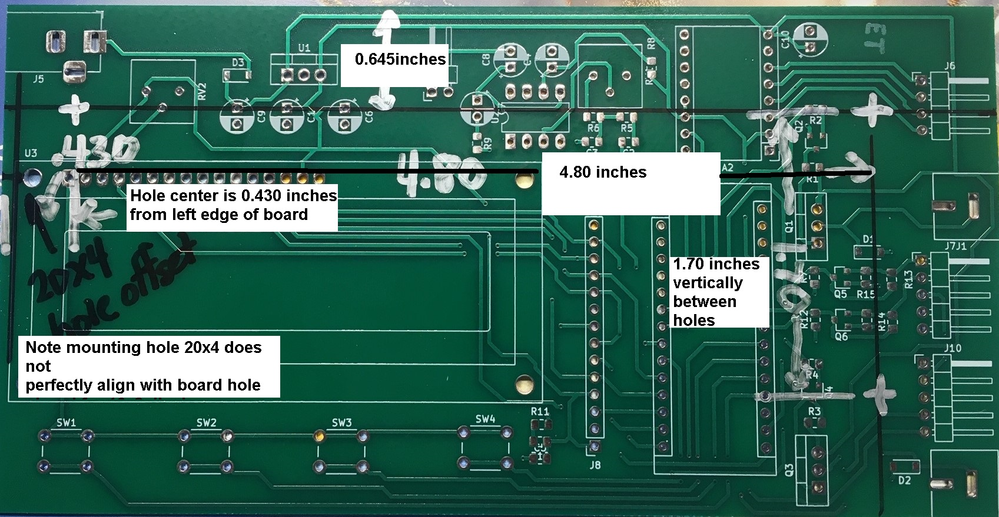

    Drawing of placement of Pin Standoff Dowels.

    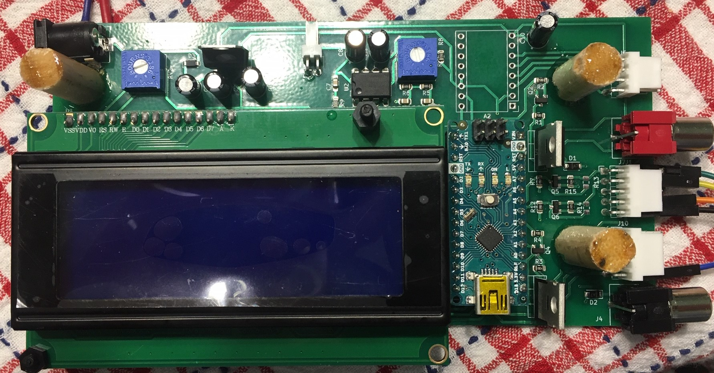

    Photo of example glued pine standoff dowels.

    Cut a hole for the chosen display following the template. It may be useful to use a 3/8” drill inside the
    corners, to allow a sabre saw (jig saw) to make the square cuts. Use a fine-toothed metal-cutting blade
    or equivalent, and go slowly.

    Either use numerically controlled drilling, careful measurements or simply affix the full size Drill
    Template to the inside of the Carlon box cover: (This is best done by spreading 5-minute Epoxy over
    the ENTIRE surface so the entire paper will be affixed and will not rip during drilling procedures.)

    

    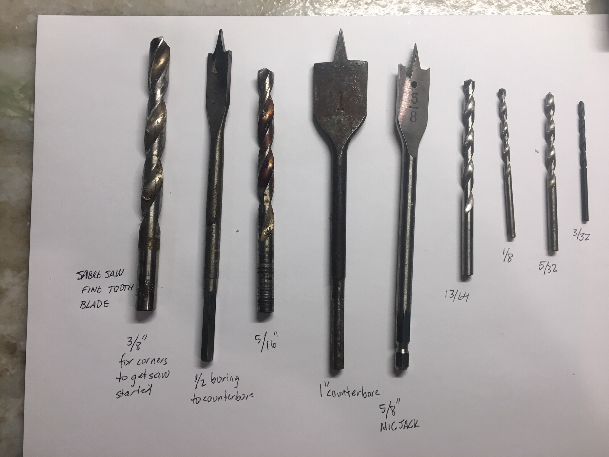

    Photo of all the tools that I used:

    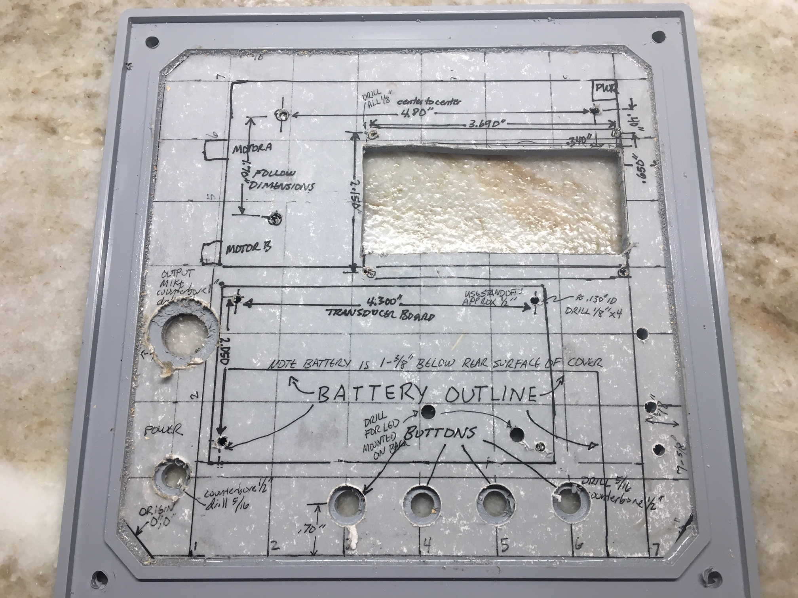

1. Test Fit the chosen display and verify that the holes for its mounting standoffs are properly located – there can be some variation in the displays. Drill for M3 plastic screws using a 1/8” drill bit and
mount the LCD display with 0.392” STANDOFFS chosen such that the Board and Display will MATE
PROPERLY when both are mounted – 0.392” standoffs (not included the threaded screw portion, but
from shoulder to end) work well.

    Mount the 20x4 display; the front edge of the Display will be flush with the INNER surface of the top
    cover. After all is assembled, this gap will need to be filled with RTV.

1. Note that many devices, including many pushbuttons, will need to have a counter-bore of the thick
electric plastic box in order to allow the short threaded portion of the device to have adequate purchase
from its assembly nut to the device. This will apply to the _pushbuttons_ , the female _coaxial power
input_ , and the _4-pin microphone output jack_. The counterbores are done with a flat cutting wood
boring bit, 1/2” and 1” as noted in the drill template.

1. Mount an input power coaxial jack suitable for the plug on the output of the medical grade Mean
Well 15VDC power supply. Wire the coaxial power input jack using #16-#18 stranded wire (red for
positive black for negative) to the “17V” input of the Transducer Board, and to ground on the
transducer board. A 15-volt medical grade MEAN WELL power supply is required, but connects to the
17V input, not the 13.8-16V input. (eg. https://www.digikey.com/product-detail/en/mean-well-usa-inc/
GSM40B15-P1J/1866-2009-ND/7703561 )

    NOTE that the Mean Well medical grade power supply produces 15VDC – but on the transducer board,
    it connects its positive output to the “17V” input. This is purposeful. The resulting output is correct.

    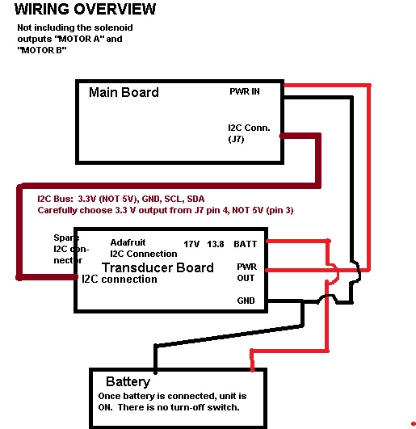

1. The OUTPUT of the transducer board will need to be connected to the Main Board using #18-#
stranded wire, paying attention to POLARITY (center positive, outer negative) on the input power
coaxial jack. It is difficult to find a male plug to fit into the main board coaxial jack – you may solder
    to the correct solder points on the main board power input jack. Note that the main board includes a
    series diode for polarity protection.

### TRANSDUCER/POWER SUPPLY BOARD: BATTERY

1. If a battery is requested by the customer, wire the battery (positive and ground wires) using
female, insulated, crimp terminals to mate with the battery and #16–#18 stranded wire. Observe
polarity; diodes will prevent the battery from being utilized if it is connected backward, but the trickle
charging circuity may be damaged. Use RED for the positive wire and BLACK for the ground
connection (to MINUS on the battery)
1. **Solder the AC PWR LED ( GREEN ) and ON BATT LED (RED) to the BACK side of the
transducer board** , at an appropriate length so that they enter the holes drilled for them on the top
cover of the box, using the plastic standoffs.
1. Mount the ADAFRUIT BMP/BME280 breakout board (https://www.amazon.com/Adafruit-
BME280-Temperature-Humidity-Pressure/dp/B013W1AJUY or alternate supplier ) to the board with
soldered connections, and glue on the barbed nipple as per demonstration and information from David
Lizdas.

    BMP280 utilize one of the 1/4” x 1/8” adapters, (from a kit such as:
    [https://www.amazon.com/Swordfish-61120-Vacuum-Connector-Assortment/dp/B07HV8CVZ](https://www.amazon.com/Swordfish-61120-Vacuum-Connector-Assortment/dp/B07HV8CVZ)
    ) epoxy glue the 1/4” side AROUND the bmp280 to the board itself, being careful NOT to get
    glue inside on the BMP280 chip.

    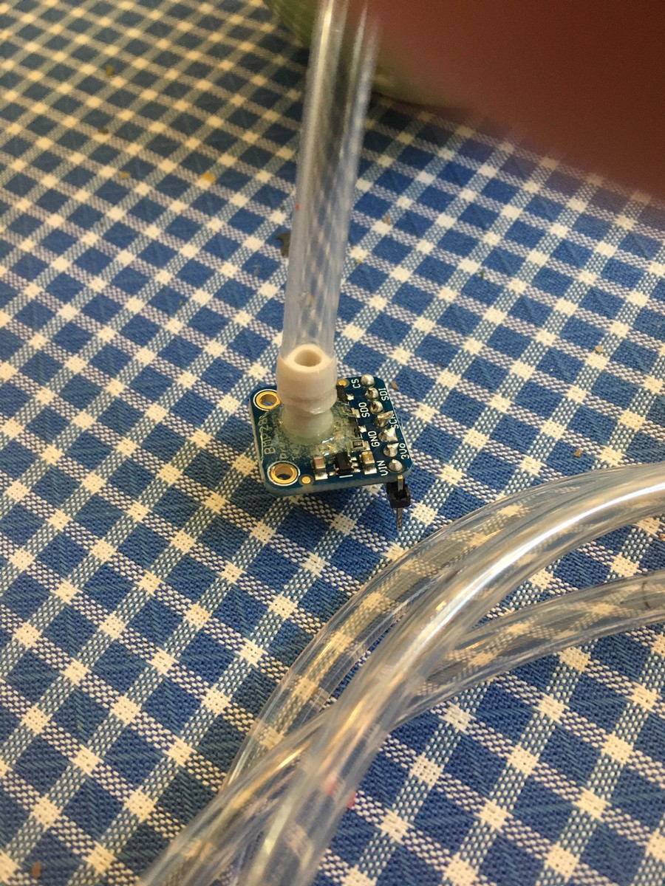

    (the 1/4” x 1/8” adapter barb is preferred to allow smaller tubing to be utilized )

1. Wire the chosen differential pressure transducer with a suitable glue onto the board; the traces on
the board **do not match the current choice for the differential pressure transducer, so it must be
individually wired to the ASHHAR 1.0 board using stranded wire (suggest size #22-#32).**

    The differential transducer part specified is: https://www.digikey.com/product-detail/en/amphenol-all-
    sensors-corporation/DLHR-F50D-E1BD-C-NAV8/442-1163-ND/6200354 Note that this is a 3.3 Volt
    maximum device I2C – do NOT connect to 5.0 V. **We unfortunately do not have a printed circuit
    board for this discrete part**. Manufacturer may optionally

    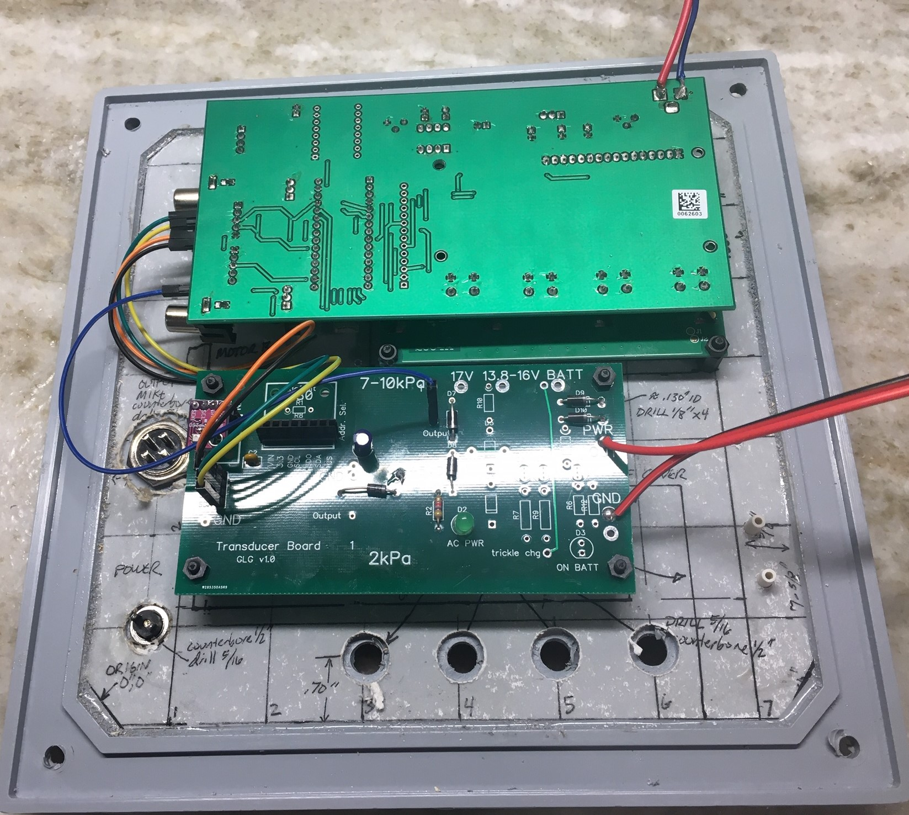

    a) wire on perfboard and make mechanically stable

    b) Redesign the Transducer/Power supply board to fit this part

    c) Create their own printed circuit board of their own design,

1. Transducer/Power Supply board is mounted on M3 0.60” standoffs at the prescribed location,
taking care so that it will not interfere with the glued battery.
1. The UF Team tasked me on Wednesday April 22 with mounting two plenums for the flow
transducer tubing INSIDE the enclosure. The LifeMech team should skip this on their prototype and
we will provide them exterior to the box. Photo below shows where I placed them. In future builds
we will move the battery off-center so that the plenums can be mounted both on the same side.

    
    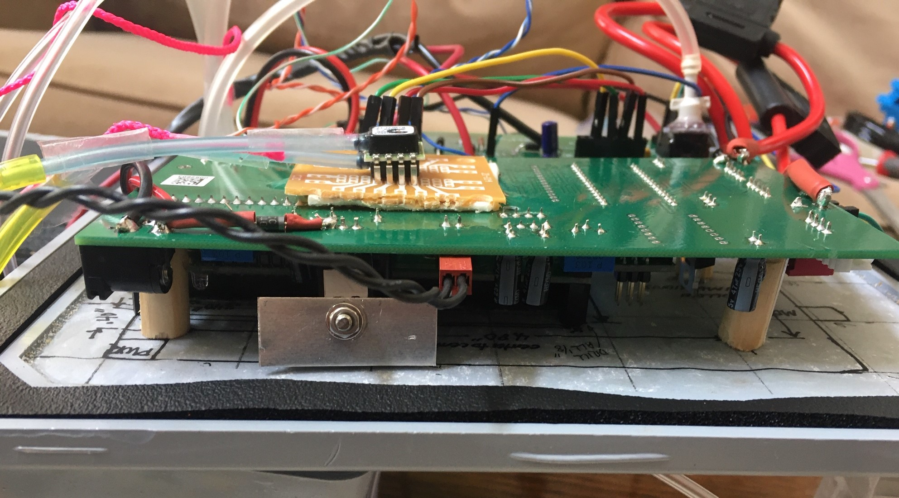

    OPTIONAL home made heatsink on the 5V regulator. Not necessary unless operated in an non-
    airconditioned environment. A small piece of any metal provides additional heat radiating capacity.
    Prevent contact with any other portion of the board as this may be at a voltage potential.

1. Manufacturer may choose to use four push buttons or a 4-switch Normally Open membrane switch
assembly. Mount the chosen pushbuttons and use wiring with very careful soldering to the bring the
four pushbuttons individually in parallel with the onboard connections to the (unnecessary) on board
pushbuttons. #22-#28 stranded wire may be utilized.

1. Output to Solenoids: Mount the output CB MICROPHONE JACK (Part:
https://www.amazon.com/PIN-PANEL-MOUNT-MICROPHONE-CONNECTOR/dp/B00H579TXU )
to the front panel and wire to the ASHHAR BOARD 1.0 as described, either with soldered wires or
with BNC or RCA Phono connectors.

    MOTORA to Pin 1

    MOTOR B to Pin 2

    GROuND to Pin3 and Pin 4

    The final product from commercial manufacturers must have 2 Amp fuse in each solenoid line. In
    this photo you can see that I did the best I could as all I had was #12 gauge fuse assemblies:

    

    NOTE ALSO that I have a (black cable) extension on the USB connector on the Arduino to make it
    easier for me to add and test code. You can REMOVE THIS before clinical delivery.

1. Connector to go to solenoids: 4-pin microphone plug: https://www.amazon.com/4-PIN-CB-
MICROPHONE-PLUG/dp/B00H572J3W Wire with shielded cable with 3 or more stranded
conductors (#16-#22) (example: https://www.homedepot.com/p/Southwire-By-the-Foot-22-4-Gray-
Stranded-CU-CL3R-Shielded-Security-Cable-57572499/204725191 ) with the shield connected to
ground (pins 3 and 4) and pin 1 connected to the INSPIRATORY solenoid and pin 2 connected to the
solenoid driving the EXPIRATORY pneumatically operated valve; the other wire on each solenoid is
connected to ground.

1. Air pressure monitoring: If possible, use 2mm tubing and 2mm brass tubes. If this is not
possible, then: Utilizing standard automobile vacuum tubing fittings such as 1/8” x 1/8” (from:
https://www.amazon.com/Swordfish-61120-Vacuum-Connector-Assortment/dp/B07HV8CVZ8 ) ,
mount and glue-secure barbs through the front panel. Using flexible tubing, connect from the inner
barbs to the

    a) manufactured nipple barb on the BMP (AIRWAY PRESSURE)

    b) upstream and downstream barbs from the ventilator airway components to the barbs on the chosen differential pressure transducer.

    I prefer to have 1/8” barb nipples for connections to small plastic tubing, such as the 1/8” fittings from
    this kit: [https://www.amazon.com/Swordfish-61120-Vacuum-Connector-Assortment/dp/B07HV8CVZ8](https://www.amazon.com/Swordfish-61120-Vacuum-Connector-Assortment/dp/B07HV8CVZ8); but for the BMP280 utilize one of the 1/4” x 1/8” adapters, glue the 1/4” side
    AROUND the bmp280 to the board itself, being careful NOT to get glue inside on the BMP280 chip.

    In the following photos, the tubing from the PATIENT side of the expiratory physical obstruction is
    marked throughout its course with red string:

    

    NOTE: If the flow measurements have the wrong sign, reverse the connections inside the box.

    

21. Provide a 2-3” 16 ohm speaker for the sound output and mount to an internal surface of the box.
22. Be certain that there will be **no mechanical or electrical conflict** when the top is affixed to the
board.

  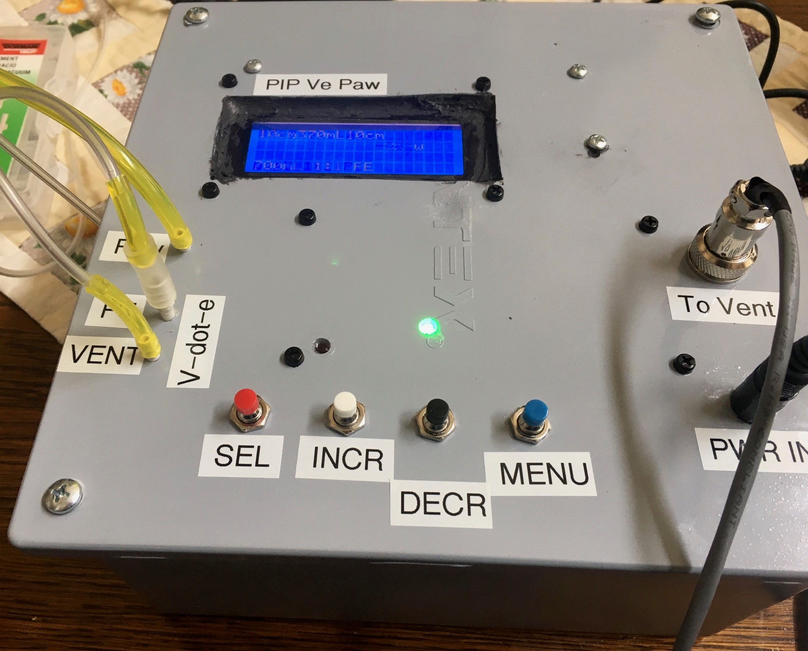

### WIRING UP PERIPHERALS

We have standardized on giving ONLY 3.3VDC to the I2C devices – wire ONLY the 3.3V output from
the board to the V-in terminal of the Transducer board. Depending on what analog transducer you may
be using, you will need to choose what voltage goes to the +5VDC – if you even use U7 or U8. These
are NOT used on the standard FDA submission version from UF

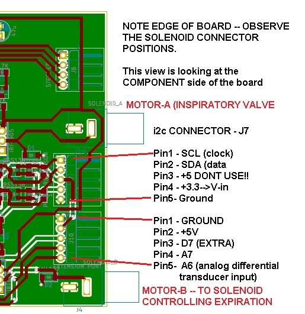

#### WIRING TRANSDUCER BOARD I2C CONNECTIONS

Make the following connections, using either secure pin connectors or soldered wiring:

Main Board J7 Transducer Board Left-Side I2C connector
Pin 1 – SCL (clock)--------------------------SCL
Pin2 – SDA (data)----------------------------SDA
Pin3 DO NOT CONNECT to I2CBus----NO CONNECTION
Pin 4 3.3VDC---------------------------------VIN
Pin5 Ground----------------------------------GND

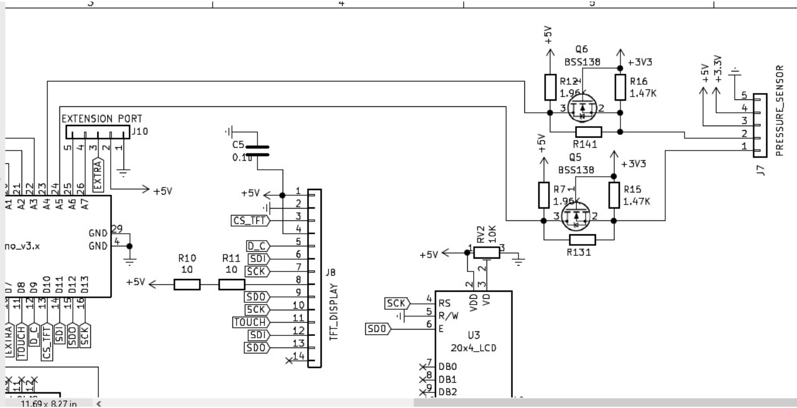

### SOFTWARE SETUP

TODO: Fix this such that pulls from github and installs automatically

Because the code for our project was developed by volunteers literally around the world, most of whom did NOT have access to the same discrete parts, we had to develop with widely varying, but functionally equivalent hardware. As a result it is easiest if you equip your ArduinoIDE as follows:

1. An overview on how to install libraries: [https://www.arduino.cc/en/Guide/Libraries](https://www.arduino.cc/en/Guide/Libraries)
1. Download and install this BMP180 Library: (don’t unzip it);
[https://groups.io/g/VentilatorDevelopers/attachment/1241/0/BMP180MI.zip](https://groups.io/g/VentilatorDevelopers/attachment/1241/0/BMP180MI.zip)

Possible alternates:

[https://bitbucket.org/christandlg/bmp180mi/](https://bitbucket.org/christandlg/bmp180mi/)

A complete set of instructions and another source for that library can be found here (strongly suggest
you read this):

[https://www.ardu-badge.com/BMP180MI/zip](https://www.ardu-badge.com/BMP180MI/zip)

We don’t actually USE this library, but your life will be easier if you just go with the flow here.

1. Download and install the ssense version of the BMP280 library:

[https://create.arduino.cc/projecthub/dragos-iosub/arduino-bme280-sensor-how-to-115560](https://create.arduino.cc/projecthub/dragos-iosub/arduino-bme280-sensor-how-to-115560)

1. SETTINGS that may be of importance to you

|File| Action| Source Code|
|--|--|--|
|Vent.h | Must uncomment the proper one to get the correct code as part of your compile for the flow transducer.|`#define ANALOGDIFFTRANSDUCER // if using the 2kPa analog transdcuer`|
|||`#define I2CDIFFTRANSDUCER // if using the I2C transducer`|
|||
|Vent.h |Get the right display uncommented!!|`#define LCDDISPLAY 2004`|
|||`//extern LiquidCrystal_I2C lcd;`|
|||`//#else`|
|||`//#define LCDDISPLAY 1602`|
|||
|Vent.h |Must uncomment to use the BMP280 (versus BMP180)| `#define USE_BMP280 1 /// set to 0 if not using the BMP280`
|||
|Vent.h |I2C flags of how the bus is working|`#define I2C_BUSY (0x99)`|
|||`#define I2C_READY (0x38)`|
|||
|Vent.h |Where to find the bmp180 library. Trying to root it out of the code is much harder than just loading it...... |`// LIBRARIES`|
|||`// BMP180 https://groups.io/g/VentilatorDevelopers/message/1241`|
|||
|Vent.h |Very important file. You must use the ssense type of BMP280 library.| `#include <sSense-BMx280I2C.h> // Download link halfway down this page:`
|||`//https://create.arduino.cc/projecthub/dragos-iosub/arduino-bme280-sensor-how-to-115560`
|||
|.ino file| Each gives terse explanation. Remember that debug code will take away crucial RAM space and may cause instabilities of the running code so only using temporarily.| `//#define DEBUG // Turn on to debug`|
|||`//#define SHOWINSTANTFLOW // to see calculations of instantaneous flow`
|||`//#define TOTALTIDAL-DISPLAY // to see the tidal volume calculated each breath`
|||`//#define BMP280DEBUG // to see serial port related to BMP`
|||`//#define AIRWAYPRESSURECHECKING // help me figure out why the valve isn't opening`
|||`//#define SERIALPRINT; // gives a load ofprintouts on pressure monitoring`
|||`//#define SMOOTHPRESSURERUN //Investigating expiratory ringing and assist control ventilation`
|||`//#define DIGITALPRESSURESPY // to see measurements related to digital I2C diff press`
||||
|.ino file| Different BMP280’ breakout boards may express different addresses.....beware!| `#define BMP_ADDRESS 0x76 // *****GLG FOR THE KEE-YEE!!!!`|
||||
|.ino file| The uBitx transceiver uses different wiring to the LCD display – be certain that you have the right pins selected if you change hardware. |`//static LiquidCrystal lcd(8, 9, 10, 11,12, 13); //when using ubitx board`|
|||`LiquidCrystal lcd(13,12,11,10,9,8); //when using the GAINESVILLE VENTILATOR`|
|Vent.h| Pin assignments for your hardware MUST be correct or things won’t go as planned.|`#define ALARM_PIN 6`|
|||`#define FN A0`
|||`#define UP A1`
|||`#define DOWN A2`
|||`#define ON_OFF A3`
|||`#define TFT_CS 10`
|||`#define TFT_RS 9`
|||`#define CS_PIN 8`
|||`#define MOTOR_A 2`
|||`#define MOTOR_B 3`
|||
||Defines the number of slices in time the respiratory cycle is set to. I don’t recommend increasing this.|`#define MAX_PHASES 20 //At 40 the machne could barely keep up`

INITIAL Qualification:

1. Apply battery power (if selected) and verify that the RED battery light comes on and the LCD
powers up.
1. Apply power from the 15V medical grade power supply and verify that the GREEN AC power
led comes on.
1. Further function testing will be provided shortly.

APPENDIX Ashhar 1.0 Board

Schematic:

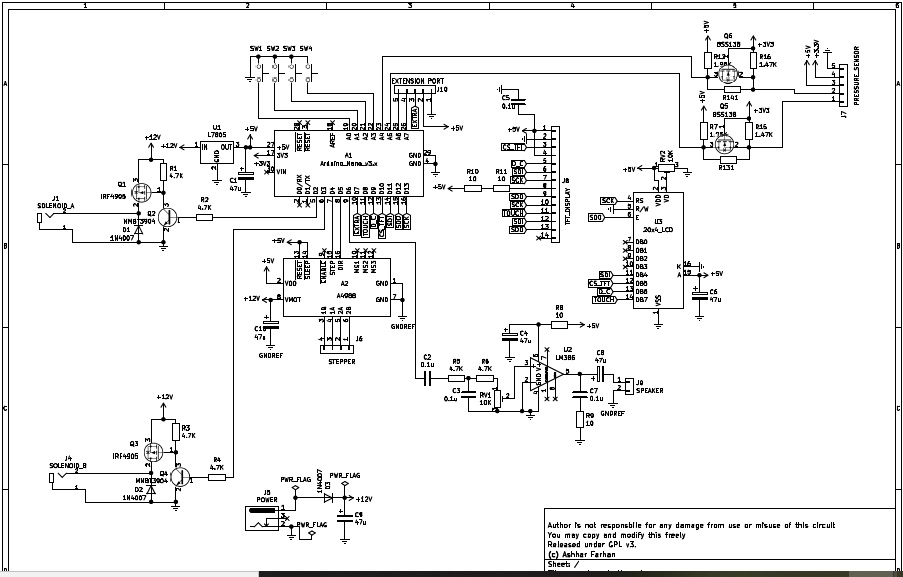
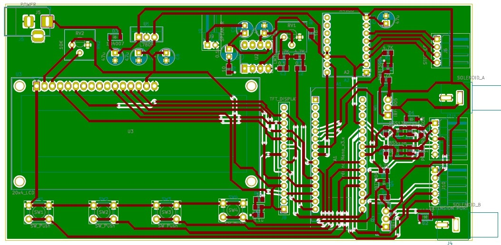

APPENDIX: Schematic for Transducer Board and Parts Values

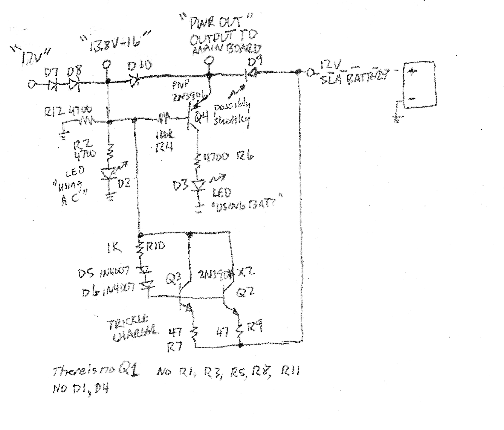

Schematic of “Transducer” Board which includes a Diode-OR connection for two different DC sources,
and a small trickle charger (constant current) for a 12 volt sealed lead acid battery.

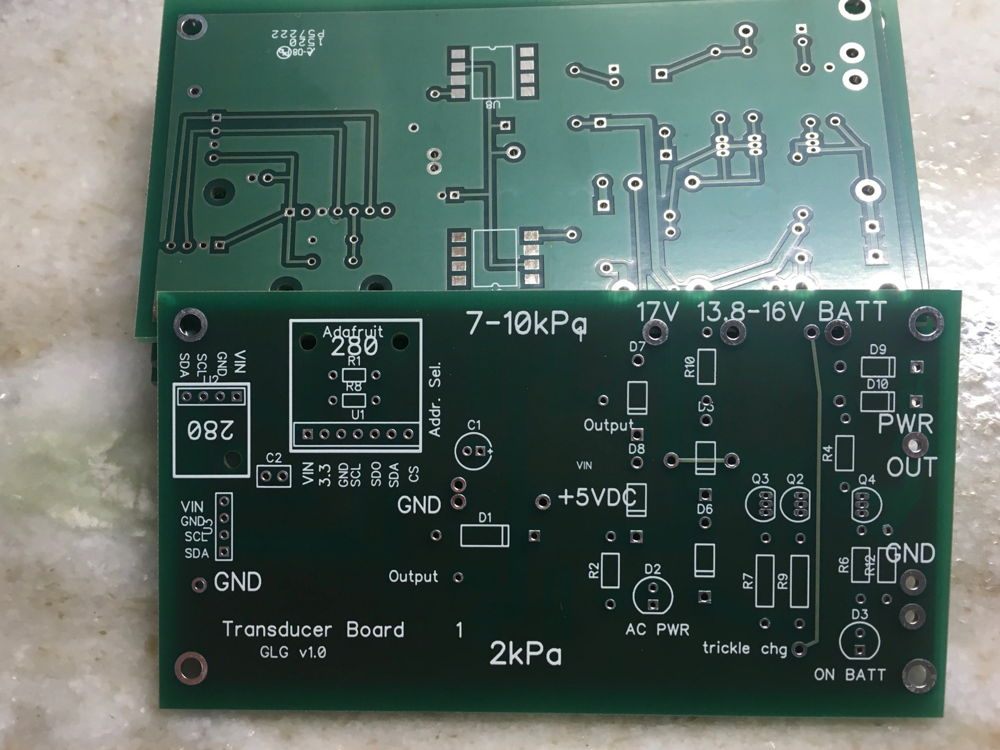

||Part|Details | Comments|
|--|--|--|--|
||Adafruit 280| Breakout board for Adafruit BMP or BME 280 (either works) R1 and R8 are NOT needed; they are there to change the address from 0x77 if desired.| Although this board is capable of operating at 5V bus voltage, we intentionally operate the bus at 3.3V because many differential pressure transducers require 3.3 V bus and will be damaged by 5V|
||Additonal “280”| This was laid out to fit a certain clone (“Kee-Yee”) of the bmp280 board – optional alternative – not needed and may be used to provide connections to the I2C differential pressure transducer.| There are many different BMP280 breakout boards on the market and they all appear to use **DIFFERENT PINOUTS.** Observe signal names carefully.
||C1| Electrolytic 20-47uf @ >20VDC||
||C2| 0.1V @ >20VDC|
||Input I2C connector| Solder or use 0.1” header as desired|
||ALL RECTIFIER DIODES (D7, D8, D6,D5, D9, D10)| 1N4007 1Amp or equivalent||
||D2 “AC PWR”| Green LED (manufacturer choice of size)|
||D3 “ON BATT”| Red LED (manufacturer choice of size)|
||Q1| none||
||Q2 Q3| 2N3904 NPN transistors||
||Q4| 2N3906 PNP transistor||
|||
||R1| none||
||R2| 4700 ohm 1//4 watt||
||R3| none||
||R4|100K ¼ or 1/8 W|
||R5| none||
||R6| 4700 ohm 1/4W|
||R7| 47 ohm ½ watt||
||R8| none|
||R9| 47 ohm ½ watt||
||R10| 1000 ohm ¼ watt||
||R11| none||
||R12| 4700 ohm 1/4W||

APPENDIX: Suggested Important FMEA topics

Assumptions: Single failures
Other input values normal.

|Function|Faliure|Cause|How weworked to show it.|
|--|--|--|--|
|Move medical gases in and out of the patient in the right amount, the right pressure, and the right timing.| Wrong gas.| Hospital line failure We can’t. |External to our device|
||Wrong mix %| Blender failure| Require external oxygen monitor.|
||Too much inspiration.| Regulator failure| Auto release of pressure if limit exceeded, auto opening of expiratory valve. High volume alarm. |
|| Too much inspiration| Patient compliance improves| High Vol alarm signals to clinician
|| Too much inspiration| Pressure sampling line gets plugged meaning we can no longer measure pressures| Alarm, either low or high pressure, and alarms, high flow.|
||Too much inspiration| Software hang| Watchdog timer will release software and reset and pause and rezero.|
||Too much inspiration| Timing failure| Extraordinarily unlikely if device passes initial quality testing. There are NO blocking calls in the software.|
|| Too little inspiration| Mechanical regulator failure| Low Vol and Low flow alarms.|
||Too little inspiration| Breathing circuit disconnection| Low Vol and Low flow alarms.|
||Too little inspiration| Plugged ETT| High pressure alarm and low volume alarm will sound.|
||Too little inspiration| Faulty flow measurement| Clinician observation of the patient as a confirmation of unusual reported values. Also blood gases.|
||Too little inspiration| Software failure “hang”| Extremely unlikelyl after long term testing of software; requires non-repeatability of code or memory leak, which would be unlikely not to show witihn a thousand cycles.|
||||Watchdog timer will reset the entire processor.|
||Too little inspiration| I2C bus failure| We designed a complete sysetm to deal properly with this extremely rare pheomenon and to continue to ventilate in an open loop manner as previously programmed.|
||Too high a pressure| Patient or ETT condition| Automatic release of pressure by both closing inspiratory valve and opening expiratory valve. High Pressure alarm.
||Too high a pressure| Clinician mis-setting| Automatic release of pressure above set limit and High pressure alarm|
||Too low a pressure| Disconnection |Low Pressure and low flow alarms.|
||Too low a pressure| Misconnection with gas flow diverted through a leak| While an obstructed leak (into bedclothes) might fool the low pressure alarm, because we measure flow in the EXPIRATORy limb, the low volume will be detected.|
||Too LONG inspiratory effort| Clinician missetting| Limits on I:e and respiratory rate make this very unlikely
||To Short inspiratory effort | Clinician missetting| Limits on I:E and respiratory rate make this very unlikely|
||Failure of ventilation system | Improper voltage from mains, resulting in damaged power supply and failure | Medical grade power supply is function from well below normal mains to well above european mains votages. Battery backup will pick up the supply and indicate the failure with a red LED. Failure of pressure monitiring or flow monitoring system.|
||Faliure of pressure monitoring or flow monitoring system | Failure of I2C buss| Solder connections; operate system at 3.3VDC; carefully developed watchdog system will kick in and provide open loop ventilation of the patient.|
||||
|Physically connect to the patient breathing circuit| Improperly fitting airway connectors. || We use industry standard sizes, so very unikely. Having pre-use checkout by clnical users should detect it
